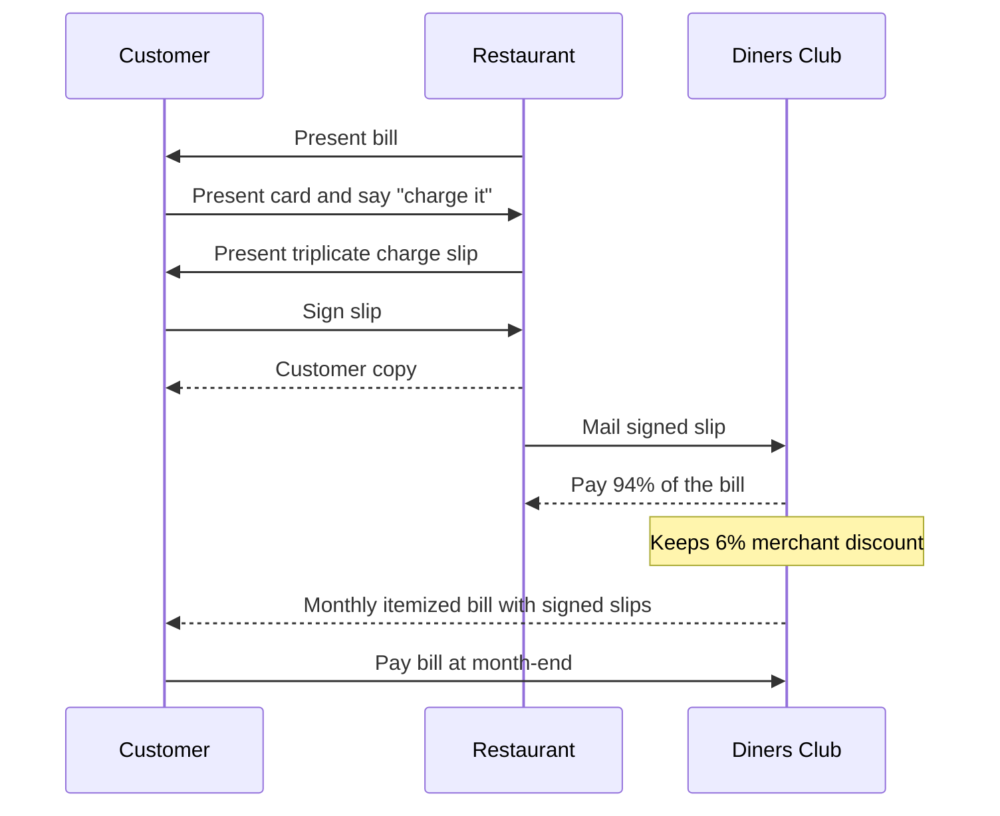
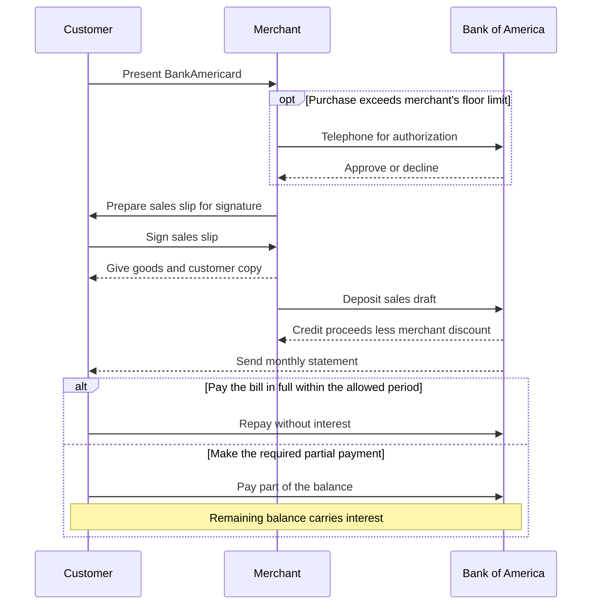

This blog began with a simple thought:What are thoughts anyways? Where do they come from?

**If phones have NFC sensors and credit cards support NFC payments, can a phone itself be used as a POS machine?**

Imagine making an online purchase and, instead of typing in your card details, simply tapping your physical card against your phone.

But then I wondered if it would actually be useful. After all, wallets like Apple Pay and Samsung Pay already let us store our cards on our phones, effectively removing the need for the physical card.

I looked into it and turns out this functionality is already in active use, both for sellers (softPOS) and end users (Tap to Pay).

I started thinking more deeply about the nature of credit cards. And eventually, I stumbled upon a much more fundamental question:

**What even is a credit card?**

As a software developer working in fintech, I already had a fair idea about modern credit cards and the elaborate payment systems built around
them. But I wanted to understand the **_why_**.

Why do credit cards exist in the form they do? What problems were they originally created to solve? How did those early solutions grow into the elaborate payment infrastructure we have today?

So I decided to read (and write) about their origins and the context in which they evolved.

As John Gall wrote in _Systemantics_:

> "A complex system that works is invariably found to have evolved from a simple system that worked."

or, as _motabhai_ put it:



Hence, this blog.

The original plan was to write about the evolution of card payment technology. But as I kept reading, I was equally fascinated by the history of the credit card itself. So I decided to split the blog in two parts. This part will
focus on the history and origins of the credit card, with the evolution of card payment technology delegated to part two.
{: .notice--info}

## What is a Credit Card?

Well, its not a Debit Card, that's for sure. In fact, I was very surprised to learn that credit cards were created much before debit cards.*More on this in part 2

On a serious note, at its core, a credit card is an instrument of identification. As a matter of fact, early versions were frequently labelled as _"Credit Identification Card"_.

But what is the fundamental concept of a credit card—_the first principle_, so to speak?

It links the cardholder to a line of credit issued by a financial institution. In that sense, it is less about the physical object itself and more about what it represents in a financial system.

Of course, modern credit cards are anything but simple physical tokens. They pack in a surprising amount of engineering: magnetic stripes, EMV chips with embedded computing capability, NFC antennas for contactless payments, holograms for anti-counterfeiting, embossed or printed identifiers, and more.

Each of these features has a story. To understand how they came to exist, we need to look at the social, economic, and technological context in which credit cards evolved.

But first, let’s take a look at the evolution of credit itself.

## The origins of credit

At `$DayJob` we have a philosophical concept of "Shape of Nature".

The concept of credit likely began to take shape with the agricultural revolution around 10,000 years ago. In agrarian economies, farmers needed seeds, water, fertilizer, and labor months before any harvest could generate income. Under these conditions, credit emerges naturally: value is provided now in exchange for value received later.

In modern terms, it is simply the deferral of payment for goods or services already consumed or utilized. At its root, this idea is closely tied to a basic constraint of agriculture itself - time. Crops take time to grow, but people need to eat and invest continuously throughout that cycle. Credit bridges that gap.

What began as a simple mechanism for moving value forward in time in subsistence economies has since evolved into a multi-trillion-dollar global financial system.

Archaeological and literary evidence shows that some form of credit existed in many ancient civilizations.

### Ancient Mesopotamia

The earliest written records of credit come from Mesopotamia, preserved on clay tablets that outlasted the empires that produced them. 



This tablet from around 1798 BCE is one of the earliest known examples of a formal loan contract. It records an interest free loan of 1½ sheckels of silver made by _Shi-sharrat_ to _Hunabatum_, repayable in the third month of the following year.

The existence of such detailed agreements suggests that credit was a common and well-understood part of Mesopotamian economic life.

The concept of interest - paying more money that borrowed for the privilege of having access to credit - had also been developed. 



The Laws of Eshnunna dating back to 1930 BCE define the interest rates as 20% for silver loans and 33.33% for barley loans.

In the ancient city of Babylon, these financial practices were later formalized into law. Around 1750 BCE, the Code of Hammurabi was carved onto a basalt stele, containing 282 laws, several of which dealt specifically with credit.



It contains a constraint on debtor exploitation:
> "If a man be in debt and
sell his wife, son, or daughter or bind them over to service for three
years, they shall work in the house of their purchaser or master; in the
fourth year they shall be given their freedom."

This provision reveals that even in the ancient world, lawmakers recognized the dangers of unchecked debt and sought to place limits on its consequences.

### Ancient Egypt

As opposed to mesopotamia, fewer records survive from ancient egypt, owning partly to the degradation of the papyrus on which things were written in ancient egypt.

There's not much evidence for
commercial credit. Loans in Egypt were still more likely to
take the form of mutual aid between neighbors.

One of the earliest references to credit is contained in the _Heqanakth Papyri_, created around 1950 BCE.



They mention "grain loans" given by the mortuary priest _Heqanakth_.

The *Instruction of Amenemope*, composed between 1300 and 1075 BCE is another record that mentions credit.



It contains a passage on debt forgiveness:

> "If you find a large debt against a poor
man,
Make it into three parts;
Forgive two, let one stand
"

Papyri containing loan contracts have also been discovered.

### Ancient India

Physical evidence of credit practices in ancient India is virtually nonexistent. This is partly due to the limited corpus of surviving texts from the Indus Valley Civilization, which remain undeciphered, and partly because knowledge was transmitted primarily through oral tradition.

However, we have significant literary evidence. The Rig Veda, composed between 1500 and 1200 BCE, includes a prayer to _Varuna_ requesting discharge from debt.

Rant
I am so disappointed at this



A key source of evidence is the Arthaśāstra, a treatise composed in the 2nd century BCE, which discusses credit policies and financial transactions in considerable detail. It advocates for the regulation of credit practices:

>"The nature of the transactions between creditors and debtors, on which the welfare of the kingdom depends, shall always be scrutinised."

The regulation of credit practices remains a subject of active debate even today.

### Ancient China



Bamboo slips containing records of private lending, interest rates, collateral have been discovered.

The *Zhou Li*, a detailed administrative manual from the 3rd or 2nd century BCE, prescribed a 20% interest cap. Mencius, writing around 372-289 BCE, condemned lending practices that drove "the old and very young cast into ditches". King Nan of Zhou, ruling from 314 to 256 BCE, built a structure so notorious it earned the name 逃責之臺 — the Debt-Evading Platform — where he literally hid from creditors. Even Emperor Yuan issued an edict around 40 BCE forgiving debts of the poor.

### Ancient Europe

Greek and Roman records show credit woven into Mediterranean commerce. Greek *trapezitai* acted as bankers, though Aristotle considered all interest usurious as money was "barren" and could not naturally reproduce. Rome formalized debt bondage through *nexum*, codified in the Twelve Tables of 451 BCE: a debtor could be held in chains for sixty days, then killed or sold across the Tiber (Livy, *Ab Urbe Condita*). The Lex Poetelia Papiria of 326 BCE abolished *nexum* after the famous incident involving Publilius, a free Roman who had been enslaved for debt. Public banking commissions called *mensarii* operated from 352 BCE, and typical interest ran around 1% monthly, or 12% annually.

> **Aside:** Notice the pattern across continents. Every civilization that developed writing also developed rules about lending. Agriculture creates seasonal gaps between work and reward. Those gaps create credit. Credit, without guardrails, creates cruelty. The regulations — interest caps, debt relief, slavery limits — are humanity's answer to that cruelty.

### Religious Perspective on credit

If rulers regulated credit, religions moralized it.

#### Semitic Religions

Judaism, Christianity, and Islam all wrestled with the ethics of charging interest. The Hebrew Bible uses the word *neshek* (נשך), literally "bite," to describe usury in Exodus 22:24-26, Leviticus 25:35-37, and Deuteronomy 23:19-21. Jewish law permitted lending at interest to foreigners but prohibited it among Jews. The *Shulḥan Arukh* (Yoreh De'ah 167:1) preserves these prohibitions. Yet Jewish communities found a workaround: the *heter iska*, developed by 16th-century Polish scholar Rabbi Mendel Avigdors, which restructured a loan as a profit-sharing partnership (Katz, 1962). The document looks like a loan; the economics look like equity.

Christianity inherited the prohibition. The First Council of Carthage in 345 condemned usury, and by the Council of Vienne in 1311, the practice was declared heresy. Thomas Aquinas devoted a full question in the *Summa Theologica* (IIa-IIae, q.78) to arguing against it. But commerce demanded flexibility. John Calvin wrote in 1545 that interest could be permitted conditionally. Henry VIII's statute of 1545 legalized 10% interest in England, and Elizabeth I confirmed it in 1571, though rates gradually fell to 5% by 1713. The religion that once called it heresy learned to call it business.

Islam took the hardest line. The Qur'an calls *riba* (ربا) not merely sinful but warfare against God and His Messenger (Al-Baqarah 2:275-281). Two forms are identified: *riba al-nasi'ah* (interest on delay) and *riba al-fadl* (excess in exchange). Rather than abandon finance, Islamic jurisprudence developed alternatives: *mudarabah* (profit-sharing), *musharakah* (joint venture), *murabaha* (cost-plus financing), and *ijara* (leasing). These structures achieve the economic function of lending while respecting the prohibition on guaranteed returns.

#### Hinduism

Hindu texts approach credit through the lens of caste and cosmic order. The *Manusmṛti* (8.140-142) prescribes tiered interest rates: 2% for Brahmins, 3% for Kshatriyas, 4% for Vaisyas, and 5% for Sudras (Olivelle, 2005). The same text mandates no interest when collateral is provided (8.143) and caps accumulation: money may double, grain may quintuple (8.151-152). The term *vṛddhi* encompasses both natural growth and usurious excess, capturing the anxiety that debt can metastasize beyond its original purpose. Kautilya's *Arthashastra* takes a more pragmatic view, allowing rates from 1.25% to 20% depending on the borrower's occupation and risk profile.

#### Buddhism

Buddhism stands apart in its relative permissiveness. The Buddha issued no blanket prohibition on lending. The *Anguttara Nikaya* (A.IV,282) advocates a balanced lifestyle that includes neither squandering wealth nor hoarding it. The *Digha Nikaya* (D.I,71) mentions borrowing specifically to develop a business. Monastic rules in the *Vinaya* barred debtors from joining the Sangha, suggesting that unresolved debt was seen as an obstacle to spiritual commitment rather than a moral failing in itself. From the 1st and 2nd centuries CE onward, Buddhist temples functioned as financial centers, accepting deposits and making loans. The *Alagaddupama Sutta* (S.I,171) holds up freedom from creditors as a form of liberation — not because credit is evil, but because obligation binds the mind.

So we can establish that credit has been there for several millennia. So what was it about 20th century America that led to the credit card revolution?

## Medieval evolution of credit

Not so fast. Before we get to 20th century America, we have around six centuries of Europe to cross.

The Roman world had bankers too — but they operated inside a Mediterranean market enclosed by a single state: one legal system, one army, one enforcement apparatus. When the Western Empire came apart, long-distance trade and the institutions that enforced obligations at a distance collapsed together, and the credit instruments died with the conditions that had sustained them. For roughly five hundred years, most of Europe's economy ran local and small: manors, rents in kind, barter, little silver.

Then commerce returned faster than coin could. Between roughly 950 and 1350, in the period Robert Lopez called the Commercial Revolution of the Middle Ages,[^lopez-commercial-1971] Italian ports reopened the Mediterranean and Europe began to re-monetize. But specie remained scarce, heavy, and lethally dangerous to haul. Moving a chest of silver from Bruges to Barcelona was not a payment method; it was an expedition.

So merchants rebuilt credit, this time in ink. "Credit commonly entered into the commercial practice of the Middle Ages"[^postan-1928] — and the Church's prohibition of usury, rather than suppressing it, determined the shapes it took. Three innovations from the period matter most to our story.

### The bill of exchange

<!-- IMAGE SUGGESTION: a diagram of the four parties to a bill of exchange, arrows of money and paper between city A and city B -->

The paper trail starts in Genoa, which preserves Europe's earliest surviving notarial registers, from 1154 — the cartulary of the notary Giovanni Scriba. Robert Lopez called them "the first source that contains a fairly large number of documents showing bankers at work".[^lopez-genoa-registers]

Among those registers are exchange contracts (instrumentum ex causa cambii) which Raymond de Roover called "undoubtedly the prototype of the bill of exchange, for it fulfilled exactly the same function".[^deroover-1953] By the 14th century the instrument had matured into the lettera di cambio: no longer a notarized promise to pay, but an informal handwritten order to pay, addressed by a merchant to his own correspondent abroad. No notary, no seal, no ceremony.

Here is a real one. On 12 December 1399 at Bruges, Jacopo Goscio delivered £55 Flemish gros to the Orlandini-Benizi company, which drew on Francesco da Prato & Co. in Barcelona, ordering payment of £312 10s in Barcelonese currency two months later to one Domenico Sancio.[^munro-bruges-1399] Note what is missing from the document: no interest appears anywhere. It was there, of course, smuggled inside the exchange rate, which the two parties negotiated at each end. The scholastics blessed the construction with a tidy formula: "absent money, which is worth less, is being bought or exchanged for present money, which is worth more".[^bell-brooks-moore] Cambium non est mutuum: exchange is not a loan. When modern researchers computed the interest implicit in the Datini companies' exchange spreads, it came out "broadly comparable" to ordinary commercial loan returns. The ban had not stopped credit; it had laundered credit into foreign exchange.

Hunt and Murray call the bill of exchange "the most important financial innovation of the time", because it fused credit, payment, and currency exchange in one sheet of paper.[^hunt-murray-1999] The card-era parallel is direct: a credit card lets you leave a store with the goods while no money moves; a bill of exchange let a merchant leave Bruges with the cloth while no silver moved.

### Deposit banking

The second innovation is quieter: money that moves by being written down twice.

Medieval moneychangers and bankers accepted deposits and recorded them in their books. Once your silver sat in a Genoese bank, you could pay another of the bank's customers by instructing the banker to transfer the claim: one debit, one credit, no coins touched, the ledger absorbing the payment. In 12th-century Genoa such book entries could be assigned outright to another merchant — early deposit-transfer banking, and the conceptual root of the cheque.[^geva-2015] The ledger, not the coin, was becoming the system of record.

The most spectacular surviving ledger of the age belonged not to Italian merchants but to warrior monks. The Order of the Temple, founded in 1119 to protect pilgrims on the roads of the Holy Land, ended up protecting their money as well. Its network of preceptories on both ends of the Mediterranean "meant that they could make specie available where and when it was needed and in the form which was locally acceptable".[^barber-1994] Deposit-taking is documented from at least 1211[^torre-2023]; by the 1290s the Temple was effectively running the French treasury, and its Journal du Trésor for March 1295 to July 1296 shows more than sixty open accounts — king, clergy, nobles, bourgeois — with transfers executed by ledger entry rather than circulating paper.[^delisle-1889] It ended at dawn on Friday, 13 October 1307, when Philip IV of France — chronically overdrawn — had every Templar in the kingdom arrested in a single coordinated sweep.

### Banking networks

The third innovation was scale: the network.

<!-- IMAGE SUGGESTION: map of the Bardi/Peruzzi or Medici branch-and-correspondent network across Europe and the Mediterranean -->

Florence's Bardi and Peruzzi companies — Edwin Hunt's "super-companies" — fielded on the order of fifteen branches and a hundred factors, from Naples, Rome, Genoa, and Venice to Paris, London, Bruges, Rhodes, Cyprus, and Tunis, on capital exceeding 100,000 florins.[^hunt-1994] Deposit with the house in Florence, draw on its correspondent in Bruges. Borrow in London against revenues collected in Italy. The branches and correspondents vouched for strangers to one another, so finance at a distance became something you could simply buy.

The super-companies also left the era's great cautionary tale. Between September 1336 and December 1337, Bardi and Peruzzi advanced Edward III of England at least £82,400 for his wars.[^fryde-1967] When the houses failed — the Peruzzi in 1343, the Bardi in January 1346 — the chronicler Giovanni Villani blamed royal default in round, thunderous figures: 900,000 gold florins owed to the Bardi by the English king alone, and 600,000 more to the Peruzzi.[^villani] The numbers are almost certainly inflated; the mess was not.[^hunt-1990-sapori] Villani's moral stands anyway: sovereign risk kills banks.

The next generation picked a safer sovereign. The Medici Bank, founded in 1397, anchored itself not on kings but on the papacy — between 1420 and 1435 the Rome branch supplied around 62% of the bank's profits.[^deroover-medici] Why the Pope? de Roover explains:

> "the pope was the only medieval ruler who had revenue flowing into his treasury from all corners of Europe, even from Scandinavia, Iceland, and Greenland... pilgrims, suitors, and emissaries preferred to provide themselves with letters of credit instead of carrying money in belts or saddle bags."[^deroover-medici]

This is the thread that runs straight to the travel instruments later in our story: the Western Union collect card, the Air Travel Card, the Diners Club. The medieval version was slower and handwritten. The underlying idea — that your credentials travel because your network does — was already complete.

Nor was Europe alone, or first. Tang China, squeezed by the same arithmetic, produced feiqian (飛錢), "flying cash": amid a coin shortage so severe that exporting cash from the capital was banned, merchants deposited coin with provincial Capital Liaison Offices and carried home a two-part certificate whose halves were rejoined at payout; the state took the system over in 812.[^feiqian] In the Islamic world, the suftaja — "a loan of money in order to avoid the risk of transport", in Joseph Schacht's tidy definition — let a paymaster in one city promise repayment in another; the geographer Ibn Ḥawqal recorded one for 42,000 dinars cashed at Audaghost around the year 977.[^suftaja] India had its own instrument family: the hundi — an unconditional written order to pay that worked as remittance draft, loan instrument, and bill of exchange all at once, with written records of its use going back at least to the twelfth century.[^hundi] The sarrafs who issued hundis also took deposits on interest and settled payments by book entry — giro — the same ledger trick as their Genoese contemporaries. When the Jain merchant Banarasi Das started out in trading around 1600, his father equipped him with a two-hundred-rupee hundi. (Etymology alert: the claim that our word "cheque" descends from the Arabic sakk is beloved by economic historians and rejected by linguists.)[^quinn-roberds] Same constraints, same designs: where money is scarce, heavy, and dangerous to move, paper becomes the message and trust becomes the infrastructure.

So why then, and why there? Economically, credit instruments resurface when trade outgrows the coin supply, and between roughly 950 and 1350 Europe's did exactly that. Institutionally, they need enforcement at a distance — commune courts, notaries, fair courts — and for five hundred years nothing in Europe could enforce a debt five hundred kilometers from home. Culturally, the usury prohibition did not smother credit; it dictated credit's camouflage, which is why the era's killer instrument is a loan masquerading as a currency swap. And technologically, the entire edifice rode what Michael Clanchy called the transition from memory to written record.[^clanchy-1979]

Rome had had bankers too; the lesson of the apocalypse in between is that credit needs two things at once — enough trade to make promises valuable, and enough trust infrastructure to make them credible at a distance. For five centuries Europe had neither; between the twelfth and fourteenth centuries it rebuilt both. Credit without coin, payments as ledger entries, finance across distance — the substrate was back. What nobody had yet imagined was extending any of it to ordinary households. That would take mass production, disposable income, and a salaried middle class with predictable paychecks — which is where we turn next.

## Rise of Consumer Credit

### traveletter system 1894

By the nineteenth century, productive credit had been a feature of economic life for millennia, yet borrowing for consumption remained socially suspect. Debt was generally considered acceptable when it financed productive assets that generated income, but borrowing to purchase household goods or luxuries was often viewed as imprudent or morally questionable.

The Industrial Revolution began to alter these attitudes. Mass production expanded the supply of consumer goods, rising incomes increased demand for them, and the emergence of a salaried middle class created a large population with predictable future earnings. Together, these developments laid the foundation for modern consumer credit.

Records indicate that both installment credit and a form of revolv-
ing credit were widespread in the early days of the Republic. Economist
Rolf Nugent noted, in Consumer Credit and Economic Stability, that
“in rural areas, horses, plows, carriages, seed, clocks, and household
furniture were frequently sold for promissory notes payable after the
harvest.” Installment sales were commonplace in urban areas, particu-
larly for high-priced durable goods designed for household use. Install-
ment credit in the early 1800s was used in much the same way as it is
used today. It was granted specifically for a single purchase and required
both a down payment and a formal contract that permitted the merchant
to retain title to the article until the purchase price had been paid. For
instance, Cowperwaite and Sons, which was founded in New York in
1807 and appears to have been the first firm in the United States to
specialize in furniture, sold goods on installment terms from its very
inception.

As installment credit gradually proved to be successful over the
first half of the nineteenth century, manufacturers began to borrow the
notion from the merchants. One of the earliest and most successful
manufacturers to utilize the installment plan was the Singer Sewing
Machine Company. Other manufacturers began to sell big-ticket con-
sumer durables, such as pianos, household organs, and stoves, directly
to consumers through agents by about 1850.

One of the earliest examples of firms capitalizing on this emerging market came in the United States, where the Singer Sewing Machine Company dramatically expanded sales by introducing an installment-payment plan.

The spurt of industrialization following the Civil War began the
long-term trend toward urbanization in the United States. A son who
had learned a trade from his father—metalworking, for example—
might discover that in another city there was a big demand for his skills
and wages were much higher. The gradual movement of family mem-
bers from rural communities to large cities helped weaken the family
bond, as well as the reliance of family members upon one another for
the provision of financing.
The increased geographic distance between family members forced
many people to depend upon third-party institutions for any financing
they might need. They were also encouraged to seek more financing
than they had previously used.

One of the more
formidable problems faced by Singer salesmen occurred in
Indo-China. Collections of payments were made difficult be¬
cause the natives frequently moved from village to village.
To insure that they would be recompensed, Singer salesmen
insisted their sales be guaranteed, usually by someone with a
settled business or a village elder. To prove identification,
the salesmen would photograph the village elder and cus¬
tomer, with the customer holding a blackboard on which
was chalked the number of the machine. For the customer
who was illiterate and couldn’t sign his name to a contract,
the Singer salesman simply took his fingerprints.

According to Nugent,
Incentives to thrift disappeared with intimate community life.
Family traditions, conservative consumptive habits, and reputa-
tions for stability gave way to competitive standards of living as
the principal basis for prestige. These changes helped to explain
two important developments in the field of consumer credit
which began shortly after the Civil War. One was the extension of
installment merchandising to low income classes; the other, the
rise of the small loan business.
It is important to note that the vast geographic size of the United
States contributed in no small way to the development of its consumer
credit industry. In European countries, the much shorter distances that
had to be traveled, along with the smaller number of large industrial
cities, enabled families to remain not only close but independent of
outside institutions in meeting their financial needs. This fact may help
explain why the consumer credit industry in general has been far less
successful in most European countries than in the United States and
why the credit aspect of credit cards may lack some of the appeal to
Europeans that it has had to many Americans.

The importance of the automobile in stimulating and legitimizing
consumer credit sales cannot be overemphasized. The growth of install-
ment sales of automobiles tended to remove the stigma that installment
selling had acquired at the hands of low-grade installment merchants in
the 1890s. All social and economic classes were represented among
installment purchasers of automobiles; hence, installment buying ac-
quired respectability. Although some automobile manufacturers, such
as Ford, were slow in implementing installment sales plans, other compa-
nies embraced this new marketing tool. General Motors soon became
the leader in installment sales.

### Installment Credit



1807, Cowperthwait

In the 1850s, a Singer sewing machine cost about $125 — roughly a quarter of the annual income of an average American worker. The price placed it beyond the reach of most households.



In 1856, Edward Clark, Singer's business partner, introduced the **hire-purchase plan**. Customers could take home a machine with a $5 down payment and pay the remainder in monthly installments of $3 to $5. The arrangement transformed a large one-time expense into a series of manageable payments. Sales reportedly tripled within a year, and by the 1870s, an estimated 70–80% of Singer machines were sold on installment plans.

Singer also developed an early form of credit scoring. Homeowners often qualified for more favorable terms than renters, reflecting differences in perceived credit risk.



{% include figure popup=true image_path="assets/images/credit-card-chronology/singer_sewing_machine_ad_the_statesman_12_july_1885.jpeg
" alt="‘Singer Machines for Modern Tailoring’, The Statesman, 12 July 1885 in
Ranabir Ray Choudhury, Early Calcutta Advertisements: A Selection From The
Statesman, 1875-1925, 1992. Calcutta: The Statesman Commercial Press. p. 184" caption="‘Singer Machines for Modern Tailoring’, The Statesman, 12 July 1885 in
Ranabir Ray Choudhury, Early Calcutta Advertisements: A Selection From The
Statesman, 1875-1925, 1992. Calcutta: The Statesman Commercial Press. p. 184" %}

Installment purchases of sewing machines escaped much of the stigma attached to consumer borrowing as they enabled home-based production and could supplement family earnings, i.e. they were a productive asset.

Singer's installment plan demonstrated that mass consumption could be financed through credit. The model soon spread to products such as pianos, furniture, and encyclopedias, helping normalize deferred payment and laying the foundations of modern consumer credit in the US.

**Aside:** The development of the sewing machine in the 1850s not only transformed the lives of tailors, seamstresses and homemakers, but also revolutionized manufacturing and marketing as well. By the turn of the century, the sewing machine, rather like the parlour organ, was a important icon of social status.
{: .notice--info}

## Origins of the credit card

### Older than plastic

Before we get to 1950, it is worth noting that neither problem is new. Authorization and authentication are not artifacts of the electronic age; they are as old as centralized record-keeping itself.

In Bronze Age Crete, roughly four thousand years ago, Minoan officials carried engraved seal-stones and signet rings — small, intricately carved objects, often worn as jewelry, with mounting holes drilled so they could hang from a wrist or neck. A priestess or merchant entitled to draw goods from a palace magazine — cloth, oil, spices — would take what she needed and press her seal into a lump of soft clay or wax, leaving an impression that recorded the transaction and its value.

The parallels to a modern card are almost uncomfortable.

The carving was **authentication**: unique, hard to reproduce by hand, and proof that the person making the withdrawal was who they claimed to be. The seal itself was an **authorization token**: it had no intrinsic value, but it entitled the palace scribes to update a ledger on the holder's behalf. And the palace archive — thousands of clay nodules, countersigned by multiple seals — was the **database**: salaries accrued as credits, withdrawals posted as debits, balances rolled forward to the next accounting period at harvest. There is evidence in the palace records of negative balances, which is to say, of revolving credit.

We tend to think of plastic as a modern synthetic. But a seal impressed into beeswax is also a polymer bearing an identity, and it was doing the same job in 1900 BCE that an embossed PVC rectangle would do in 1958 CE. What changed was not the idea. What changed was the volume.

**DELETE THIS**: By the late nineteenth century, the United States was undergoing rapid industrialization and economic expansion. Businesses were growing, trade was increasing, and consumers were becoming more mobile than ever before. These changing economic conditions created new problems and new opportunities. In response, businesses began experimenting with novel ways to extend credit and manage transactions, laying some of the groundwork for what would eventually become the modern credit card.

### First mention of credit cards

The first known description of a credit card in the context of payments appears in the _About Town_ column of the _Ottawa Weekly Republic_ on March 1, 1877:

> "About the most convenient arrangement for trading, we have ever seen, are the new style of credit
cards for grocers or any kind of merchants. The cards are issued to customers and cost $5. They have numbers running from one to fifty cents, and when you want to purchase goods you present your card, and the amount you buy is punched out. They save the trouble of pass books, enteries on ledgers or blotter, and where you pay cash for them you get 5 per cent off."

A few months later, the Cassopolis Vigilant (July 19, 1877), seemingly referring to the same invention, made the following observation

> "They are an ingenuos[sic] device, and the best form of individual book keeping we have seen."

The newspaper descriptions are particularly interesting because they are not isolated references. We can find a patent published a decade later that describes a system broadly similar to the one discussed in these articles. It includes an illustration of the device, giving us a rare glimpse of what an early "credit card" was imagined to look like:



In fact a "charge card" based on the principle of "punching out the amount purchased" was issued in the 1930s, as evidenced by the following advertisement:



However, all these were essentially prepaid instruments and the invention of true "credit" cards would have to wait several decades.

### First card with "credit" on it:



This is the first customer card, that we know of, to use the expression "credit". It was issued in 1896 by a transports company as a loyalty card, for exclusive use in the customer's relationship with the issuing company.

## Precursors to the credit card

While the success of instalment plans for consumer durables was changing attidue towards consumer credit, the mechanisms for open-book credit were stretched to its limits with the geographical expansion of the US.

### Open book credit

Long before credit cards, there was open-book credit, one of the oldest forms of consumer lending. The idea was simple: a merchant would provide goods today and record the debt in a ledger, with the expectation that the customer would pay at a later date.

Open-book credit worked because commerce was local. Customers were usually known personally to the merchant and lived in the same village, town, or neighborhood. Trust, reputation, and repeated interactions formed the foundation of the system. A grocer might maintain a running account for a family, recording purchases in a large ledger and settling the balance weekly, monthly, or after a harvest.

In many ways, this system remains alive even today. Walk into a _kirana_ store in a small Indian town and you may still find a notebook containing the names of regular customers and the amounts they owe. Purchases are added to the account throughout the month and settled later, often when salaries are received. The technology has changed remarkably over the centuries, but the underlying idea of "buy now, pay later" remains the same.

The simplicity of open-book credit was also its greatest weakness. It relied on personal familiarity between merchant and customer. As long as businesses operated within small communities, this was sufficient. But the United States of the late nineteenth and early twentieth centuries was changing rapidly. Cities were growing, businesses were expanding, and customers were becoming increasingly mobile.

In small communities, everyone knows everyone. The grocer trusts the carpenter's son, and the tailor extends credit to families he has known for years. Personal relationships were the original credit infrastructure. But as commerce expanded beyond local neighborhoods, the notebook system struggled to scale. Merchants needed a reliable way to identify customers and their credit accounts without relying on personal acquaintance.

At the same time, businesses were becoming increasingly interested in customer loyalty. The rise of automobiles made it easier for consumers to travel farther for shopping, while chain stores and gas stations competed for repeat business. Merchants wanted a way to distinguish their customers, simplify credit transactions, and encourage them to return.

These pressures created the conditions for the next major innovation: the charge coin.

### Charge coins



**but that became problematic as urbanization and larger stores meant that recognizing customers and trusting them to pay wasn’t quite as a reliable method as it used to be. So, stores would provide a means of identification with the name of the store, and perhaps a number to confirm you were who you said you were. These credit indicators were only good at one store, but they were really the beginning of consumer credit in the way we think of it today.**

**Until about 1930, outstanding consumer credit was dominated by**
noninstallment credit, largely charge accounts. The growth in the size
of retail establishments, as well as in the number of customers and the
volume of business, meant that not every charge account customer
could be recognized by clerks in the store. Some form of identification
became necessary—hence, the credit card.

Regarded as one of the earliest direct ancestors to the modern credit card, Charge Coins were first issued shortly after the American Civil War and grew increasingly popular into the early twentieth century. They replaced handwritten identification in a ledger with a physical token. Merchants—particularly department stores, hotels, and taxi companies—would issue customers a small metal or celluloid coin embossed with the merchant's name and an account number. Some were round like ordinary coins, while others resembled small badges or tags designed to be carried on a keychain.

The idea was simple. Instead of identifying themselves to a clerk and having their account located manually, customers could present their charge coin when making a purchase. The merchant would then use the account number on the coin to look up the customer's file and verify that their account was in good standing before approving the transaction. The actual bill would be settled later, typically on a monthly basis.

For merchants, charge coins offered a more scalable alternative to open-book credit. They made it easier to identify customers, manage accounts, and process credit sales as businesses grew beyond small communities. For customers, they offered convenience and a tangible symbol of membership in a merchant's credit program. In farming communities, they were especially valuable because they allowed farmers to obtain supplies throughout the growing season and settle their accounts after the harvest.

By modern standards, the system was primitive. The coins carried no security features, transactions were verified manually against paper records, and a lost coin could potentially be misused. In fact, some issuers required customers to publish notices in local newspapers warning merchants not to honor a lost coin.

Most importantly, charge coins were **closed-loop** systems. A coin issued by one merchant could only be used at that merchant's establishments. A department store's coin worked at that department store; a taxi company's coin worked only with that taxi company. There was still no concept of a universal payment network, but the essential idea had appeared: a portable token that identified a customer and granted access to a line of credit.

#### Familiar Feature: Account Number



We can see a familiar feature in charge coins: the **account number**.

This was the key innovation of charge coins. Charge coins made credit impersonal. Instead of personally knowing the customer, a clerk only needed to look up the account associated with the number stamped on the coin.

The same idea persists today. Modern credit cards are far more sophisticated, but at their core they still serve as identifiers for a credit account.

While the U.S. led these commercial innovations, global parallels were already forming. In Sweden, for instance, a 1912 report in Svenska Handelsbanken described internal credit ledgers used by banks and department stores. Meanwhile, in Germany, companies like Kaufhaus des Westens (KaDeWe) issued stamped payment cards to repeat customers, operating on closed-loop credit systems. Different implementations were converging on the same solution: extending credit beyond the limits of personal familiarity.

### Department Stores

Descriptions and illustrations of dif-
ferent types of plates, as well as the metal-embossing machines that made them,
are found in William H. Leffingwell, The Office Appliance Manual (Chicago, 1926),
405–37

These cards served the
dual purpose of identifying a customer with a charge account and also
of providing a mechanism for keeping records of customer purchases.
The use of such cards continued to grow after the end of the First
World War until the growth was halted by the depression. During the
Second World War, most firms did not use these cards as a result of
the wartime credit restrictions - lewis mandel 1972book

Department stores had already been extending credit to consumers in the form of charge accounts.

As department stores grew, so did the volume of credit transactions. Recording a customer's details on every charge slip was cumbersome for clerks and slowed down the checkout process. Introduced by Farrington Manufacturing in 1928, the Charga-Plate was designed to streamline this workflow.



Resembling a military dog tag, the metal plate contained the customer's name and address embossed on its surface along with a paper signature card on the back. Stores such as Bloomingdale's, Saks, and Gimbels widely adopted the system for their charge-account customers.

Upon charging a purchase, the consumer presented the charge plate to the clerk, who placed the plate in a small imprinter (about the size and shape of a stapler), with a charge slip on top of the plate. Downward pressure on the imprinter recorded the customer’s data from the plate onto the charge slip via an inked ribbon. The customer then signed the charge slip, authorizing the purchase, while the various copies were retained by the store and customer for record-keeping.

**Aside:** Each Charga-Plate also contained two additional, unseen pieces of information: the position of the circular notch in the edge of the plate represented the city for which the plate was issued, while the position of the square notch represented a specific store  within that city. A single plate might contain several square notches, if more than one local retailer participated in the Charga-Plate system.
{: .notice--info}

While still a closed-loop credit product, the Charga-Plate represented an important step forward: it transformed the card from a simple identifier into a tool for automating transaction processing.

#### Familiar Feature: Customer Signature



Charga Plates had a paper card on the back where the customer had to sign before using the card. This signature could be matched with the signature on the sales slip by the clerk
and could be used as a rudimentary form of fraud prevention. This signature field was quite common until recently in modern credit cards

#### Familiar Feature: Embossed Text

Another common feature betwen modern credit cards and charge plates is the embossed text. It allowed mechanization of the process of writing down customer information on sales slips and reduced clerical errors.

Modern credit cards also used this feature, although in recent times with the advancement of technology, paper sales slips hve become obsolete and latest credit cards generally don't come with embossed letters.

#### Innovation: Revolving Credit



Henry Morgan first revolved credit



In 1938, John Wanamaker's department store promoted a store-account system it called "Revolving Credit." Contrary to some later accounts, Wanamaker did not present the plan as a novel invention; the advertisement explicitly stated that revolving credit had long been used in banking and business. The innovation, from the consumer's perspective, was that customers could make purchases up to an approved credit limit and repay the balance in installments while restoring available credit as payments were made. In the example provided by the store, a customer granted a $200 credit line could purchase $200 worth of goods, pay $50 per month, and regain $50 of purchasing power with each payment.

Equally significant, Wanamaker emphasized that the account carried no carrying charges and required no promissory notes or formal loan agreement. Rather than transforming consumer credit into an interest-bearing revenue stream, the plan was marketed as a convenient budgeting tool that helped households manage irregular expenses and seasonal purchasing needs. The advertisement portrayed revolving credit not as a source of finance charges, but as a means of smoothing consumption over time while maintaining an ongoing customer relationship with the store.

Around the same period, some department stores introduced budget or charge-account arrangements that allowed customers to defer repayment over multiple months. These differed from traditional installment plans and monthly charge accounts, which typically required repayment according to a fixed schedule or in full when billed. However, the specific Wanamaker plan advertised in 1938 was notable for allowing balances to be repaid over time without any stated carrying charge.

### Western Union



In 1912, Western Union issued what is believed to
be the first consumer charge card—a small rectangular piece of paper, containing
the account number, the name and address of the person or company responsible for
paying the charges, and a signature line. The card identified the billing account,
and the signature could be used to authenticate the cardholder.
The collect card evolved from Western Union’s earlier system of company-issued telegraph franks, which authorized employees to charge communications expenses to their employer. The 1912 collect card extended this concept into a broader consumer and business credit service. The launch year has been incorrectly reported in many sources as 1914. Based on the following 1913 news article and the above mentioned image of a 1912 card, we can conclusively say that the collect card
was launched in 1912.



... or so I thought, until I found a Western Union collect card from _1991_. Talk about suffering from success smh.



So the mystery still remains ig. All that for a drop of blood.

Contemporary Western Union advertising and press coverage highlighted the collect card as a new convenience for trusted customers. The card served both as a security measure for the company and as a pass for the customer, allowing holders to send "collect telegrams" and other communications from any Western Union office without additional identification, deposits, guarantees of tolls, or advance payment. Instead, the transaction was charged to the account associated with the card and processed through Western Union’s centralized accounting system. By combining customer identification, account authorization, transaction recording, and deferred billing in a single instrument, the collect card embodied many of the same operational principles that would later characterize charge cards and credit cards.



The small rectangular paper card contained an account number, the name and address of the party responsible for payment, and a signature line. When a telegram was sent, the clerk recorded the card number on the message form or a separate "toll ticket", the customer signed the transaction record, and the paperwork was forwarded to Western Union’s centralized accounting office for processing and billing.

**Aside:** A **collect telegram** was one in which the recipient paid the transmission charges upon delivery of the message. In contrast, a **paid telegram** was one for which the sender paid the charges before the message was sent.
{: .notice--info}

The cards were issued yearly.

In 1948, the card came to be designated as a "Credit Card".





### Oil Companies



In 1924, General Petroleum, a chain of California gas
stations, issued the first cardboard credit card, calling it
just that, the “General Petroleum Credit Card,” using,
for the first time, the name that Bellamy had given his
cards thirty-six years earlier. Mobil Oil and Shell soon
followed suit.

In 1914, Texaco began issuing paper gasoline cards, and in 1924 the General Petroleum Corporation of California introduced “courtesy cards,” which allowed trusted customers to charge gasoline and related purchases at affiliated service stations. Around the same time, Standard Oil of California issued its own cards, which were personally signed by the company president. These paper-based charge cards were typically distributed by station managers to regular customers and could be used across stations within the same franchise network, often spanning large geographic areas.

Although these card programs frequently operated at a financial loss, oil companies viewed them as a strategic investment in brand loyalty. Because gasoline was largely a standardized product, motorists had little reason to prefer one station over another, particularly while traveling. A charge card created an incentive for customers to seek out stations within the same branded network, increasing sales and strengthening customer attachment to the brand. The cards also made franchise expansion easier, as oil companies could attract new station owners by promising access to a large base of loyal, card-carrying customers. For station managers, the system provided a convenient way to extend credit without having to handle the complexities of billing, accounting, and debt collection themselves.

A major milestone occurred in July 1938, when several regional Standard Oil companies agreed to honor one another’s cards. This arrangement created the first national credit card interchange system, allowing cardholders to use a single card across multiple affiliated companies and geographic regions. The innovation foreshadowed the broader credit card networks that would emerge in the postwar era, laying the groundwork for modern payment systems in which a single card can be accepted by many independent merchants across vast distances.

### Hotels

### Airlines



In 1936, a coalition of airlines launched the Air Travel Card, one of the earliest organized charge card systems and a key precursor to the modern credit card. Under the Universal Air Travel Program (UATP), the allowed business travelers to charge airfare and pay later, introducing an early form of standardized account-based payment in commercial travel. UATP operated its own private clearinghouse to process transactions, helping to streamline billing between airlines and corporate customers. Notably, the Air Travel Card also introduced a numbering system that remains in use today, with UATP cards still beginning with the digit “1.” Only UATP cards start with the number 1 because they were first.

The system proved highly successful and influential. By 1941, the Air Travel Card accounted for roughly half of participating airlines’ revenues, demonstrating the viability of large-scale deferred payment systems. Its scale continued to grow, and by 1968 UATP was processing around one billion dollars in sales across 111,000 business accounts, with approximately 1.5 million cards in circulation. As one of the earliest standardized, multi-issuer charge systems with centralized clearing, the Air Travel Card helped establish foundational practices—such as account numbering, centralized transaction processing, and post-purchase billing—that later shaped the development of modern credit cards.



**Aside:** In 1939, 90% of airline flights on the planet were by a Douglas DC-3 or some variant
{: .notice--info}

By the end of World War II, the average American carried a dozen or so card-like objects — gas cards, store plates, airline cards, each valid only with a single merchant. The wallet bulged with plastic and metal fragmentation. What the system needed was unification.

All of these
early versions of credit card had in common the advantage of offering an
alternative to banknotes and coins as well as delay payment in cash (and some
even offered rollover credit while paying a minimum amount). But most had the
disadvantage of being limited to the issuing merchant (often a local business).

### Universal Payment Card

The obvious unifier was the bank: it held the deposits, employed the credit clerks, and already operated the small-loan departments. But in the early 1940s, the notion of a bank offering its customers charge credit was not merely untried — it was a punchline. In August 1942, _Banking_, the journal of the American Bankers Association, printed a cartoon of a fashionable young woman at the paying teller's window:



The joke turned on the absurdity of the request. A paying teller could only hand back money the customer had previously deposited; asking him to pay out against a mere promise to settle later inverted everything a bank did. Charge accounts belonged to department stores, not banks. Within a decade, exactly that request — charge it at the store, settle with the bank — would be the industry's newest line of business.[^bank-charge-cartoon-1942]

Merchants, for their part, had already tried to build a universal system themselves. Farrington Manufacturing, maker of the Charga-Plate metal identification tags used by department stores, had long been promoting its pet project, the "United Chargaccount Service" — a central billing office that would gather charge slips from a group of stores and mail the customer a single itemised monthly bill, dividing her payments among the merchants she owed.[^central-billing-1945] The store trade was unmoved: in a National Retail Dry Goods Association survey of 100 stores, 96 said they did not believe central billing would profit them, fearing above all that it would sever the close credit relationship that kept customers loyal to a particular store. Farrington offered to finance a demonstration installation for any group of stores in a town between 40,000 and 200,000 people. There were no takers.[^central-billing-1945] If everyday credit was to be unified, the banks would have to do it.

#### Bankway



The first bank to issue anything it called a credit card was not in Brooklyn or Manhattan, but in Buffalo. On 27 October 1945, the Buffalo Industrial Bank introduced its **Bankway Credit Card** in an advertisement in _Dziennik Dla Wszystkich_ ("Everybody's Daily"), Buffalo's Polish-language newspaper: a "1945 Credit and Identification Card" bearing the customer's name and signature beside that of the bank's president, with the tagline "Buy on time the 'BANKWAY' — ask your dealer!"[^bankway-ad-1945]

Under the Bankway plan, the prospective purchaser went to the bank, established his credit, and was issued a card — renewable yearly — specifying how much installment buying it entitled him to, along with a directory of cooperating retailers.[^bankway-nyt-1945] Presenting the card at any of some 200 participating dealers — in automobiles and airplanes, boats and motors, furniture, household appliances, and home modernization — earned immediate credit after a phone call to the bank, with no further questions asked. The buyer signed an installment contract with the retailer, who sold the contract to the bank; the buyer then paid the installments, with interest at bank financing rates, directly to the bank. The retailer ran no credit check, held no paper, and collected no payments. "We are the first bank in the country to inaugurate such a plan," said Kenneth R. Reid, the vice president in charge of business development, expecting some 600 western New York retailers to join "as rapidly as consumer goods are made available."[^bankway-nb-1946]

Bankway was a genuine bank credit card, and in its market — durable goods bought on installments — it worked. But it was grafted onto the installment contract rather than onto the everyday charge account. The card that would matter more was aimed at the neighbourhood shops.

##### Credit vs Charge

In modern lexicon we differentiate between **charge cards** and **credit cards** based on the presence of revolving credit.

If you've used credit cards, you might have come across the term **"Minimum Amount Due"**. Modern credit cards have this feature
of revolving credit, where you can pay a certain percent of your total overdue amount (e.g. 10%) and can keep using the credit card. The remaining overdue
amount will attract an interest at obscene rates (starting from 1.5% per month/18% per annum). This allows credit card holders to spend
more than what they can comfortably repay in a month. Not being prudent with this feature is a surefire way to enter a debt trap.

Early cards did not have this feature. You had to repay the entire amount you owed at the end of the month, failing which could
result in fines.

Although this is a well established distinction now, early cards used them interchangeably with many charge cards calling themselves
as credit cards.

##### Unfamiliar feature: Customer address

#### Charg-It

## Add scrip image

https://archive.org/details/sim_burroughs-clearing-house_1950-11_35_2/page/28/mode/1up
https://archive.org/details/sim_burroughs-clearing-house_1950-11_35_2/page/74/mode/1up

The first steps toward a universal credit card system were taken in 1946 by **John C. Biggins**, a consumer credit specialist at the Flatbush National Bank of Brooklyn. Biggins began thinking about a structural inequality in retailing: small specialty stores could not afford a full-fledged credit department, which left them at a disadvantage against the department stores extending credit to the same customers. Banks, Biggins decided, could come to the rescue of the small merchant — and pick up a nice line of business doing it. His answer was **Charg-It**: a community credit plan under which customers of a number of small stores could charge merchandise, while the local bank stepped in to take over the credit risk and run the complete credit operation. Crucially, the bank would judge creditworthiness from credit bureau records rather than personal relationships — a bank directly giving consumers revolving credit for everyday purchases, for the first time.[^chargit-bw-1950][^flatbush-history]



Flatbush National put Charg-It into trial in 1946, issuing its customers a credit plate and a book of scrip — paper certificates equal to their approved monthly credit limit — to spend at participating Brooklyn shops. The plan was genuinely revolutionary, but it did not outlive the bank itself. Biggins's father, John Biggins, Sr., sold the Flatbush National to the much larger Manufacturers Trust Company, and the new owners — confronted with a Brooklyn experiment that must have baffled them — promptly canceled it.[^flatbush-history]

Biggins carried the idea with him. He joined the Paterson Savings and Trust Company of Paterson, New Jersey, in 1947 to set up its time-plan department, and there rebuilt Charg-It from scratch.[^chargit-bw-1950] The re-launched plan went into effect on **6 September 1950** — the first bank-sponsored community credit plan of its kind in New Jersey, and one of the first in the country.[^chargit-banking-1950] It had been announced to merchants at a dinner meeting in late August; twenty-five stores — shoe, sporting goods, apparel, furniture, and other small shops — were participating on opening day, and thirty had signed up within weeks.[^chargit-banking-1950][^chargit-bw-1950]



The mechanics were clever, if fussy. A customer applied at any participating store for either a regular 30-day charge account — billed and payable in full every month — or a revolving account, which allowed up to six months to repay an established limit: a customer granted $180 owed $30 a month, and could keep charging up to the limit so long as payments were regular. Paterson Savings checked the applicant with the local credit bureau, then issued a credit plate similar to the Charga-Plates of the big stores, together with a book of scrip equal to one month's credit limit. Making a purchase meant presenting both plate and scrip book and signing a sales slip; the clerk tore out enough scrip to cover the price and attached it to the slip. Since scrip came in denominations of $1 and up, clerks collected the odd difference in cash (up to 99¢) or took scrip to the next full dollar — the customer being billed only for the purchase. At the end of the day the store turned the slips and scrip over to the bank, which immediately credited the merchant's deposit account for the full amount. Collecting from the customer was henceforth the bank's problem, by means of a single monthly bill covering all Charg-It stores, payable at the bank. Customers paid nothing extra for the privilege — "your magic Charg-It plate is your automatic OK," the bank advertised.[^chargit-bw-1950][^chargit-banking-1950]



The scrip was the control: presenting it proved the account was in good standing, sparing clerks a credit check on every sale. It was also the plan's weak point — fussy to carry, fussier to count. A 1978 retrospective in the Congressional Record described these early plans as involving "a paper credit card and a book of scrip," and judged the scrip's paperwork "burdensome."[^bank-card-congress-1978]

For the merchant, the price was an 8% fee on each Charg-It sales dollar — high next to the 4-6% a big store paid to run its own credit department, but the bank investigated accounts, collected bills, and absorbed the risk, putting the small shop on an equal footing with its bigger competitors.[^chargit-bw-1950] Biggins had organised Retail Charge Account Service, Inc. as the owner of the copyrighted Charg-It plan, which licensed the Paterson bank to operate it locally and set about peddling the idea to other banks. By 1952 the plan had gone west: the First National Bank of Bellevue, Washington, became the fourth Charg-It bank — and the first outside New Jersey — following the National Newark & Essex Banking Company and the First National Bank of Jersey City.[^chargit-west-1952]

Biggins's plan was relatively successful,
but it had much greater significance for the credit
industry: it ushered in the era of the third-party, universal credit
card — without a doubt, the most important development in the history
of credit cards.

## Diners Club



Despite prior attempts, the era of the modern, third-party, universal card truly began with **"Diners' Club"**.

There is a famous story about its invention. Although there are some variations in later sources, the story as it appeared in _Newsweek_ on 29 January 1951 (p. 73) is as follows:

> "About a year ago, Frank McNamara, president of a New York credit company, enjoyed a wholesome, expensive lunch in a New York restaurant. Halfway through his coffee, McNamara made a
familiar, embarrassing discovery; he had left his wallet at home. By the time his wife arrived and the tab had been
settled, McNamara was deep in thought. Result: the "Diner's Club," one of the fastest-growing service organizations."

This story reads like a legend: a troubled McNamara, struck by a flash of insight, goes on to kick-start a multibillion-dollar industry. It’s the stuff of fairy tales.

Except it’s fake.



This story was invented in 1950 by the company's first press agent, **Matty Simmons**.

When he had asked McNamara how he actually got the idea, the founder merely smiled:

<blockquote>
  
"I just get ideas. I write them down
and think about them for a while. Then I throw out the
ones that don’t float. This one was never discarded."

  <legend><cite>Frank McNamara, on how he came up with the idea of Diners Club</cite></legend>
</blockquote>

"That wouldn't do," Simmons confessed decades later. "I had to glamorize the creation of the credit-card plan…" So he wrote this apocryphal tale
which has been repeated and publicized for decades. It ended up becoming a part of the company's official history, and the Diners Club website still presents this story as fact.[^simmons-catastrophe]

There's also the question of how could a businessman who had forgotten his wallet still have his Diners Club card? Where do we keep our cards? That's right: in our wallets. The card would have been sitting right there alongside the cash he'd left behind, leaving McNamara in exactly the same predicament.

In fact, the version Simmons intended was that McNamara "hadn't brought enough cash"[^simmons-catastrophe], not that he forgot his wallet itself. This is the version
that actually makes sense. The story intended to portray the intended motivation for Diners Club as not having enough cash at hand, not the "forgot
his wallet" version that has been incorectly reported everywhere. Its almost as if nobody bothered to stop and think through what they were publishing 🤦‍♀️.

The actual inception of this idea was less dramatic and more interesting.

### Genesis of the idea

The real story begins in 1949.

Francis X. (Frank) McNamara was the head of a finance company, the **Hamilton Credit Corporation** (incorporated in New York on **24 March 1949**).[^nydos-diners] He ran the company from his attorney Ralph Schneider's office on the 68th floor of the Empire State Building. Schneider
was a Harvard Law School graduate "who gave him the use of a desk".[^mandell-history][^simmons-catastrophe][^linkedin-simmons]

One day, he happened to cross paths with his friend, Alfred Bloomingdale, while the latter was visiting New York. Bloomingdale was the
grandson of one of the founders of the posh Bloomingdale store, that is to say, he was born into generational wealth.

Frank invited Alfred to join him and Ralph for lunch at **Major's Cabin Grill**, where he ate lunch everyday.[^mandell-history][^linkedin-simmons]
It was a popular New York restaurant of the period whose location next door to the Empire State Building was then a considerable asset.[^mandell-history]

As the three men continued talking, the topic of the conversation shifted to an amusing scheme being run by one of Hamilton Credit's clients.

This businessman, operating in Bronx, **lent his own store charge accounts to his poor neighbours for a fee**. If one of his neighbors needed a prescription in the middle of the night, this entrepreneur would tell the neighbor to go to a particular
drugstore and use his charge account, which he would okay over the phone. If the prescription were, say, $30, he would then charge the
neighbor $40 and collect it over time.[^mandell-history]

What intrigued them the most was this novel idea of a middleman using *his own creditworthiness* to borrow credit from a store and re-extend it to a stranger with a markup.[^mandell-history]

The three men picked the Bronx scheme apart and found two flaws in it:
1. The man was lending to the wrong people (the poor are the least able to repay)
2. He had to wait for an emergency before anyone needed his service

They pondered over the idea and thought of issuing "charge cards"
for extending credit. Charge cards were already commonplace at the "important restaurants" in New York, in fact, Bloomingdale had 21 of them. Perhaps because
they were sitting in a restaurant they thought this scheme would work best at restaurants. Restaurants offered the mirror image of the Bronx scheme. They had steady, everyday patronage by people who could comfortably pay.

They perceived the primary market to be
salesmen traveling around New York who would probably want a way
to charge their meals.

They called the proprietor of the restaurant, "Major" **Compson Satz**, over to the table and asked how much he would pay for business he would not ordinarily get. "Without flinching, Major replied, **"7 percent"**, a number that established a major industry and persevered as the industry standard for several decades." Asked later where the figure had come from, Major answered: "A travel agent would have charged 10 percent."[^mandell-history]

### An enterprise is born



Encouraged by their discussion over the luncheon, the men decided to set up a small business to test their idea. 

It was not a radically new concept, they simply combined well-established credit practices into a business: **a third party interposed between the
grantors of credit (restaurants) and the users of credit (diners), selling credit itself as the product**. The commission charged to the restaurants, called **"discount"**, would be the means of paying for the operation.[^mandell-history]

To Frank McNamara, it was an idea that had potential, and he believed someday the card would be honored at restaurants all over New York City. **_Restaurants_**—thus the name Diners Club.[^simmons-catastrophe]

To start the new enterprise, Bloomingdale wrote a $5,000 check, while McNamara and Schneider contributed additional funds, bringing the total
initial capital to $18,000. McNamara contributed Hamilton Credit's receivables totalling $35,000 and was able to borrow $35,000 from
the bank against it. Thus,
a new company was begun within the folds of the Hamilton Credit Corporation.The corporate entity that launched Diners Club cards was Hamilton Credit Corporation; it would not be renamed "The Diners' Club, Inc." until September 1955.[^nydos-diners][^mandell-history][^diners-capital-conflict]

Shortly after that luncheon, Bloomingdale returned to California. Although he was personally intrigued by the idea, Bloomingdale had lent the money to McNamara more out of friendship
than in hopes of beginning a profitable venture.[^mandell-history]

McNamara and Schneider lost no time in launching the new enterprise from their office in New York's Empire State Building. They had two problems to solve:
- They didn't know how to sell the plan to the public
- They had limited contacts in the restaurant industry

McNamara tried soliciting a number of restaurants but was struck out everywhere. The problem was that he was persuading restaurants to
issue credit to customers that would be paid by him at a later date, while they didn't have the slightest idea who he was.

As a result, they hired **Matty Simmons** as their press agent. Simmons was doing public relations for many leading restaurants and nightclubs in New York at the time and as a result had contacts in the restaurant industry.

Major's was the first restaurant to agree to honor Diners Club cards, who, in all likelihood, didn't have much of a choice. Simmons helped
add more restaurants to this lonely list, including _The Chambord_, _Bagatelle_, _Embassy Club_ etc.[^simmons-catastrophe]

Cards were sent, unsolicited, "to several thousand prominent businessmen with a letter revealing its wonders". There was no membership fee and the
card had fourteen restaurants listed on its back that honoured Diners Club.[^simmons-saturday][^simmons-catastrophe]

The scheme was simple: McNamara and Schneider would issue charge cards to be used at New York–area establishments. Every month, they'd bill the user of the card for his charges during the previous 30 days. The cardholders would be charged nothing, the restaurant would receive 94 percent of the total, and Diners Club would get the rest.

The Diners Club was in business.

### The "First Lunch"



The era of the modern credit card started on **8 February 1950**, with the first Diners Club transaction happening at **Major's Cabin Grill**.[^simmons-saturday]

On that fateful day, McNamara, Schneider, and Simmons sat down to lunch at Major’s, each carrying a freshly issued cardboard card.

When the bill arrived, McNamara produced his card, numbered 1000 (i.e., #1). The waiter stared at it, puzzled. Then he remembered that Major had briefed the staff that very morning. He glanced at Major, who nodded from twenty feet away.[^simmons-saturday][^simmons-catastrophe]

The waiter walked off with the bill and card in hand. He returned with a triplicate sheet given to him by the cashier, which had a rectangular box with the price of the lunch and a space for a tip. Two carbon sheets separated the three pages, so that when McNamara signed for lunch, the signature would appear on all three sheets. [^simmons-saturday][^simmons-catastrophe]

After McNamara had signed, the waiter pulled the third sheet (customer copy) and handed it to him. The top sheet was to be sent to the Diners Club, and the middle sheet (merchant copy) was kept by the restaurant.[^simmons-saturday][^simmons-catastrophe]

Frank turned to Ralph and Matty and smiled:
<blockquote>
  
"Goddamn it! It worked!"

  <legend><cite>Frank McNamara, on completing the first Diners Club transaction</cite></legend>
</blockquote>

At that singular moment in history, Major's Cabin Grill was the only place on the planet where "a credit card" was accepted in lieu of cash.

This was the first ever transaction done by a Diners Club card. It wasn't the first universal charge card, that was Bankway. Nor was it
the first universal "Credit Card" transaction, since there was no revolving credit involved. Yet, it was the beginning of a revolution in payments.

### Mechanics of a transaction

Strictly speaking, what they had built was a **charge card**, not a credit card. For the technically inclined readers, the following
diagram should help understanding the transaction mechanics:

For customers, the mechanics were familiar to the pre-existing charge cards: hand over the card, say "charge it", sign the slip, pay the bill at the end of the month. The only distinct feature was that the card could be used
at multiple restaurants. So instead of paying the bills for multiple restaurant charge accounts, customers received a single unified and itemized bill, from Diners Club.

The bill also came with the original signed sales slips enclosed. This was known as **"country club billing"** and managing all
the paperwork was a very resource and time intensive job.[^mandell-history][^vanatta]

For merchants the scheme was substantially different. Instead of maintaining their own charge account department and dealing with collection
from individuals, they could simply mail the signed slips to Diners Club and get paid promptly, with the club absorbing the risk.

The price was the **merchant discount**: restaurants received only 94% of the bill amount, with Diners Club keeping 6% as its commission.[^simmons-catastrophe]

### Growing the Business

I grew up in a world where credit cards were already commonplace. Most big offline retailers and all online websites accepted credit cards
in India by the time I finished school. Merchants accepting credit cards seems to be a no-brainer to me. Which is why it is very amusing to me
that there was a time when sellers had to be convinced to accept credit cards.

In that regard, Diners Club was the pioneer. It convinced a critical mass of merchants to trust a third-party for extending credit
to consumers. It created the market that allowed modern credit cards to flourish.

In the early years of the Diners Club operation, new ideas and
innovations flew about at a rapid pace, and nearly every aspect of today's credit card business that was technologically feasible was tried.

As Simmons stated in his Book, _The Credit Card Catastrophe_:

> We were in a
business no one had ever been in before, so there were
no guidelines and few limitations. We couldn't hire
experts because there were no experts where there had
been no business.

Their first challenge was signing up restaurants and customers. 

The unsolicited mailing of the cards to prominent businessmen helped create the first cardholders. For marketing to customers, the initial approach was simple and inexpensive, they slipped advertising leaflets under the doors of offices in the Empire State Building. The card was free and there was no credit check. The applicants simply walked up to the office and "if they looked trustworthy and claimed to have a job, they were given a card."

Simmons's contacts helped them onboard the initial cohort of restaurants, who joined "albeit begrudgingly". They claimed to the restaurants
that someone _charging_ for food and drink will spend more money than if he had to pay with cash.

In the first month of operation, Diners Club did **$2,000** of business. In the second month it grew even more rapidly and they
needed additional capital. When they approached Bloomingdale for more funding, he demanded a substantial stake in the firm. Confident in their venture's success, the two entrepreneurs refused to give up significant ownership.[^mandell-history][^simmons-catastrophe]

As a result, Bloomingdale began
his own credit card operation in Los Angeles, known as Dine and Sign.

#### A quarrel between friends



https://oregonnews.uoregon.edu/lccn/sn90066132/1951-05-02/ed-1/seq-17.pdf

https://newspaperarchive.com/daily-independent-journal-may-01-1951-p-14/?utm_source=chatgpt.com/

Following his friends on the east coast, Bloomingdale signed up 25 restaurants in Los Angeles. He issued 20,000 cards. To figure out whom to send the cards to he used indicators
of affluence, e.g. he bought a list of **Cadillac owners**, all of whom were mailed free Dine and Sign cards.
Within three months he was doing $150,000 of monthly business, but the business was facing a myriad of problems. The staff could not tell from the charge
slips who was charging because the signature frequently bore no resemblance to the name. So Bloomingdale was forced to hire handwriting
experts who examined voting records to try to find out who was using the cards.

The credit
card was so new that recipients thought it was a gag and started using
them to "play along." Some of them lent the cards out to their friends,
creating additional problems.

The business was floundering and Alfred was running out of capital. By this time his friends in
New York
were doing about $250,000 a month and losing money. Before the end of 1950 the two systems were merged, under
the assumption that "if they were all going to go broke, they might as well do it together".
Bloomingdale invested an additional $25,000 and got a 15% stake in the consolidated business. A second billing office was opened in L.A. and
Bloomingdale was made vice-president for western operations.[^mandell-history][^simmons-catastrophe][^nyt-bloomingdale-1968]

#### Financing the cashless dream

By the fall of 1950 the card was honored in New York, Chicago, Boston, Philadelphia, Miami and Los Angeles, and nearly **30,000 cardholders** were charging **$250,000 a month**, yet the company, grossing some $16,000 a month from its percentage, was still **losing money**.[^simmons-catastrophe]

Financing the operation was a challenge in itself. They tried different techniques. The initial merchant discount rate **(MDR)** had been 6%,
but after the first two dozen establishments were signed it was determined that it was not enough. The fee to all new signees was raised to 7%
(the suggestion by Major).

No bank was willing to extend the credit
needed by the corporation. Therefore, in its first year of operation, the
company was forced to use a **"factor"** (moneylenders who loan money for commercial ventures) to whom Diners Club sold its
accounts receivable at a discount.

Another problem was that they had to pay the restaurants before they collected money from cardholders. Not being a bank, it could not fund
itself on deposits.

An interesting trick they used exploited the cheque clearing systems of the era. Since they had offices in both Los Angeles and in New York,
i.e. on the opposite coasts of the US, they took advantage of this by writing cheques for New York bills from the L.A account and vice versa.
This provided the company additional float. Until one instance that bloomingdale recalled: "one time a bank merged with helicopter and all my
checks bounced."[^mandell-history]

They also introduced a **$3 annual membership** fee for cardholders. While there were apprehensions that this would lead to loss of customers, it only
ended up removing the customers who didn't use the card.
Schneider's hunch that "we'd lose the people who don't use the card, but the people who do won't mind paying a small fee", proved exactly right; only the non-users dropped out. By early 1951 the company became profitable[^time-1951] and it did not post another losing year for the next seventeen years.[^simmons-catastrophe]

It was then able to obtain credit, first from a small bank
named Sterling Bank and later, when the company became much more
successful, from the larger banks, which began to compete for the privilege of lending it money.

By 1953 the fee was $5 a year[^nyt-rice-1953] and by the end of the decade the merchant commissions covered the entire cost of running the company, so the fee was nearly pure profit.[^ebsco-diners][^black-1961]

By the first anniversary the club had **42,000 members and 330 establishments**; Time marveled that they "need never pay the waiter when they wind up a spirited evening on the town. They simply sign the check, get billed once a month."[^time-1951]. Credit losses ran a quarter of one percent, and the largest tab any member had yet signed was $496.[^simmons-catastrophe]

The Henry Hudson Hotel extended the right to charge
rooms to members so it was literally no longer merely, a
"Diners" club. Other hotels quickly followed suit. Budget Rent-a-Car agreed to become the first car-rental system to honor
the card.

#### The appeal of the card

By the end of its first year, articles started appearing in national media outlets like _Businessweek_, _Time_ etc. Cardholders were growing
rapidly.

Apart from the fact that it reduced the need to carry cash, one of the main appeals of the Diners Club card for customers was **prestige**. The fact that they were trusted to hold what amounted to
a blank cheque was a source of pride. McNamara claimed that "If you're a businessman and you're entertaining clients or working on a deal, the
people with you will be impressed."

Another reason to prefer the card for spending was taxes. Taxes, substantially increased
to support the war, were still high, and entertainment
spending for business was deductible, but bookkeeping
for this purpose was haphazard as were records at most
corporations for entertainment expenditures. Using Diners CLub card for spending meant that you received an itemized bill at the end of the month.
This served as "ready-made accounting of their expenses for income-tax purposes" that they could submit to the IRS.
Even the _Joker_ doesn't mess with the IRS!

As Hillel Black put it in 1961: "only the needy carry cash." A reader survey that year found the average member was 42½ years old, married, a college graduate with 2.1 children, a $30,419 house and an income of **$16,876 — three times the national average**; salesmen and corporate executives made up over 45% of the rolls.[^black-1961]

Diners Club sought to quantify its benefit for merchants and commissioned a survey that found out that a Diners Club cardholder spent **18%**
more than a cash customer. This was their standard answer to restaurants who grumbled about surrendering 7%.

A big-brain move Diners Club did is starting the _Diners Club Magazine_, later renamed _Signature_. Originally a newsletter titled _Diners Club News_ and "stuffed into billing envelopes", it was created by Simmons.
The magazine was opt-out rather than opt-in, with a $1
annual fee, and very few people "get around to saying
they don't want something". This led to over 90% of the members subscribing to the magazine, which was briefly just as profitable
as the card business (because of restaurant advertisements). The $1 was added to the annual fee so it qualified for second-class postage.



The magazine became an important bargaining chip when signing up merchants. Diners Club offered coverage in the magazine as a benefit
to prospective merchants to make the 7% MDR easier to swallow. Simmons wrote its restaurant column under the pen name **Franco Borghese**; a good review would jam a restaurant for weeks.[^simmons-catastrophe]

_Signature_ was the first magazine to carry mail-order ads that gave the purchaser the ease of simply filling in his credit card number with the order. Huge online businesses like Amazon have business models that are really based on this original Signature innovation: buy with your credit card.[^simmons-saturday]

#### Some stubborn shops

Signing up merrchants was an uphill battle. The 7% MDR was a constant source of complaints, but any requests to decrease it was firmly denied.

There were times when establishments made a united front against Diners Club in an area, but all of these attempts were outmaneuvered by the
witty entrepreneurs. There was an instance when the restaurant association in the state of Washington
attempted to keep out Diners Club by having association members agree
to not accept the card. Bloomingdale broke that boycott through the
extreme method of starting his own restaurant in downtown Seattle.
Since his was the only restaurant that would accept Diners Club,
cardholding businesspeople who happened to be in Seattle would flock
to it. Pretty soon, the other downtown restaurants that were dependent
on the patronage of traveling businesspeople gave in.[^mandell-history]

When top restaurants in Milwaukee (and then Seattle) organized a rate revolt in the late 1950s, demanding the discount be cut and threatening mass exit, Simmons flew in, privately bought the ringleaders off with ad pages and cash advances, and watched the rebellion die mid-meeting when Mokey Friedman of Eugene's Restaurant rose to his feet: "I've known Al Bloomingdale for years. I knew Al when he'd pay a thousand bucks just to watch two flies fuck. He doesn't need our money. I'm not dropping out." All but the two instigators stayed, at full rate; the Seattle revolt "evaporated."[^simmons-catastrophe]

Sometimes they even paid money upfrot to establishments in exchange of future Diners Club charges to sign them up. **Stork Club** and Toots Shor's were among these establishments with Stork CLub receiving $50,000.[^simmons-catastrophe]

Airlines offered fierce resistance as well, until Simmons signed up Northeastern Airlines and other airlines fell in place for the
fear of losing clients.

Department stores resisted for the longest. They were not even able to sign up Bloomingdale's, the store started by Alfred's granfather!

Though the 7% MDR eventually had to be reduced. Starting with airlines, due to high ticket amount the MDR was reduced to 3%.
Although the company tried very hard to maintain a uniform discount for restaurants, in order to not favor one over another, it
was forced to break that rule when it began to sign up restaurant chains.[^mandell-history]

In addition, Diners Club was not able to maintain its policy of paying
only once a month when the credit volume from restaurants grew
extremely large. In places like New York, the company often had to pay
twice or three times a month, although it maintained its once-a-month
payment policy in more rural areas.[^mandell-history]

### Cometh the fraudster

The card soon attracted people willing to exploit it. At first there were no spending limits and no way to know whether a card
was blocked. In the earliest days, the number of establishments was so low that Diners Club just called them and told the
card numbers not to accept. Later they developed **hot lists**, list of blocked cardholders that were periodically sent to
the establishments. The cashier would check the card number against the hotlist before accepting a card payment.

Later the concept of floor limits was introduced. Below a certain amount the cashier could simply accept the card, but above
that threshold, say **$100**, the cashier had to call Diners Club and authorize the transaction. He/She was given an authorization
code that was written down on the charge slip.
Diners Club even hired a detective to catch card thieves! 

In the winter of 1958–59 a stolen-card ring worked Miami Beach for **$75,000–$100,000** in false billing, sometimes with the aid of knockout drops; one nightclub billed $500 to a phantom customer *and added $400 for the tip*. Texas passed the first credit-card-crime statute in May 1959.[^black-1961]

### Going international



The Diners Club went international before its 2nd anniversary. In **1951**, finders services announced a credit card plan in U.K.
under license from Diners Club. At start this was a very informal agreement. A British citizen on the American lecture circuit became
intrigued by the Diners Club idea. When he approached the company
and asked whether he could start it in England, he was given the go-
ahead. Thereafter, they merely exchanged charges, with no franchise
fee or other payment coming to Diners Club. Later on, they concluded a
more formal agreement, and eventually the American Diners Club
owned 50 percent and one share.[^mandell-history]

In 1953, Diners Club becomes the first internationally accepted charge card when businesses in the U.K., Canada, Cuba, and Mexico agree to accept the card.

The first international issuance was in **1955** in France. Thereafter it spread acrosss Europe and the rest of the world.

finders card: https://www.theguardian.com/lifeandstyle/2013/feb/13/hugo-dunn-meynell?utm_source=chatgpt.com
https://pure.bangor.ac.uk/ws/portalfiles/portal/19758173/2017_Ascent_of_plastic_money.pdf, p. 10
https://www.hatads.org.uk/catalogue/record/f91ccbcc-7026-46d7-83c0-711fe6f55a32

### Evolution of the card

When Diners Club started in 1950, the list of restaurants honoring the card easily fit on the back of the
cardboard credit card.



When those numbers grew, they
printed the card on an accordion pullout, and there
were seven pages of listings. The next step was a booklet with the credit card as its cover.





By the midfifties,
the number of services and places honoring the card
was so large and the book so thick that they started issuing a separate credit card. By the end of the
decade, they had regional booklets for the United States
and individual listings for foreign countries.
The card
continued to made of cardboard until the advent of
plastic in the sixties.





### After the origins

Frank McNamara sold his shares in Diners Club in 1952. He was doubtful of the future growth potential of the company.

<blockquote>
  
"It'll peter out at 250,000 members, last for a while, then disappear like the zoot suit."

  <legend><cite>Frank McNamara, on selling his stake in Diners Club, 1952</cite></legend>
</blockquote>

Needless to say, this did not happen and Diners Club kept growing. A year after he sold, membership passed a quarter million[^simmons-catastrophe] and was more than
a million by the end of the decade?

Diners Club went public in **1955**.

There were some interesting promotional tactics they utilized. They sponsored the production of a film, *The Man from the Diners' Club*.
To launch the film, Simmons and his brother proposed putting an entire town on credit cards for 24 hours: on **13 March 1963**, cards were issued to **all ~10,000 residents of Winsted, Connecticut**. The Board of Selectmen obligingly made it *unlawful for any person to pay cash* for the day, junior cards went to the children. Simmons wrote the front-page obituary in the Winsted Evening Citizen: "CASH DIED TODAY! … Cash, which was born several thousand years ago, the son of Barter, the adopted child of Trade, died today in Winsted, Connecticut." It went off without a hitch; at day's end Schneider shook his hand: **"This is it. This is the future."**[^winsted-1963]

A lot happened after this, but this blog is focused on the origins. You can check out the references to learn more about the history.

Diners Club still exists today, albeit as a much smaller player. As Mandell observed, "its relatively small place in today's credit card marketplace gives little indication of its status as the pioneer of the modern credit card industry… their contributions have largely been forgotten."[^mandell-history]

### No credit for Neil
A funny bit of trivia I found: In 1974, Diners Club **denied** Neil Armstrong's application for the card. 5 years _after_ he had walked on the moon!



## Franklin National Bank



It was the **Franklin National Bank** of Franklin Square, Long Island — headquarters near the first Levittown, in the heart of the burgeoning suburbs surrounding New York City — that refined the neighbourhood charge plan into the recognisable ancestor of today's card. Franklin was the first bank to offer a general-purpose credit card, and the Federal Reserve's task group on bank credit cards dates the program from **August 1951**, calling it the first of the current bank credit cards — although it did not reach full-scale operation until April 1952.[^fed-task-group]

The plan began with the merchants. At a bank-sponsored conference called to consider how local retailers could build their businesses, the shopkeepers pointed out that perhaps their greatest need was more charge accounts; maintaining credit facilities of their own was, for many, an impossible burden. Could the bank help? "We'll try," said Franklin National's president, **Arthur T. Roth** — and the "Franklin Charge Plan" was the result.[^franklin-banking-1952]

The mechanics sharpened the Charg-It design. The purchaser presented a credit card issued by the bank and took the goods without paying cash; at the end of the day, the dealer sent his credit sales slips to the bank, which accepted them like cash — **without recourse** — and immediately credited his account, deducting a 5 percent service charge. At the end of the month, the customer received a statement from the bank with the accumulated slips and paid the bill to the Franklin. A special department, with its own staff, investigated every merchant before admission and every customer before issuing a card, posted tickets to ledgers as they arrived, and billed on a cyclical monthly schedule. Delinquencies ran about the same as on ordinary installment loans.[^franklin-banking-1952]

Gone was the Charg-It scrip. As the Congressional Record's history of payment cards put it, Franklin National refined the early Brooklyn and Paterson plans "with the development of a sales slip worded in the form of a bank draft. This more workable plan was rapidly adopted by other banks and became the basis for the modern-day credit card."[^bank-card-congress-1978] The card also gave its holders a line of credit, allowing them to make only partial payments each month; the bank charged merchants a fee on each transaction and customers interest on the unpaid balances — revolving bank credit in near-modern form.

At first, the new service was used mainly to handle the credit and collection needs of local fuel-oil companies. But by the next year, 750 local merchants and 28,000 customers had signed up, charging $2.5 million in the first year. In 1952, the National Bank of Kalamazoo, Michigan, licensed the program from Franklin and signed up 30 merchants and 18,000 customers in three weeks; other local banks also began offering credit cards.[^franklin-aba] Banking's contemporaneous count, in June 1952, was about 23,000 Nassau County families holding the card, who had charged more than $1,000,000 of goods and services — with some merchants reporting sales volume up by about 30 percent.[^franklin-banking-1952]

Roth hoped the plan would benefit Long Island's stores as much as its consumers, but participation came slowly at first, and his robust restaurant credit service — developed in cooperation with Gourmet and Esquire magazines — was unsuccessful, with too many customers not paying. The business ultimately proved unprofitable in its original iteration, and the card program was eventually wound down; the credit card department and payment window are still extant in a basement room near the vault. But the bank credit card was indeed developed in Franklin Square, and Roth's ideas on consumer credit anticipated developments which reshaped the American economy and are embedded in everyday life today.

## American Express

American Express had an excellent reason to dislike the credit card: it already had an excellent business without one.

Founded in **1850** as an express company carrying freight and valuables, it had expanded into money orders, travelers cheques and travel services. Its travelers cheque, introduced in **1891**, solved a familiar problem: how to carry money abroad without losing everything if your wallet disappeared. The customer signed the cheque when buying it, then signed again when spending or cashing it. American Express guaranteed payment and could replace lost cheques. Its name became familiar to travelers, hotels, banks and shopkeepers around the world.[^amex-background]

{% include figure popup=true image_path="assets/images/credit-card-chronology/amex_travelers_cheque_20_dollars.jpg" alt="An American Express twenty-dollar travelers cheque showing signature and countersignature fields" caption="A later $20 American Express travelers cheque, illustrating the signature and countersignature arrangement; its issue date is unspecified. Image via <a href='https://commons.wikimedia.org/wiki/File:American_Express_Traveler_Cheque,_with_denomination_20_US-Dollars.jpg'>Wikimedia Commons</a>, listed there as public domain." %}

For American Express, the arrangement had another attraction. **The customer paid first.** Between selling a cheque and redeeming it, the company held the money and could invest it. This was the profitable *float* that Diners Club threatened to disturb. A traveler who could sign for dinner or a hotel room might buy fewer cheques before leaving home.

### The card that almost came first: 1946

American Express had considered a card **before Diners Club existed**. In **July 1946**, an unnamed airline executive approached assistant vice president **Louis S. Kelly** with a suggestion: an American Express travel charge card for business people. Reed initially liked the idea and asked **William Eichelberger**, the company's travel sales manager, to study it.[^amex-1946-plan]

By the end of 1946, Eichelberger had drawn up a **corporate travel card** proposal. Participating companies would deposit **$400–$500** with American Express as security against default or misuse. Their travelers could then charge transportation and other travel arrangements through American Express offices, or directly with carriers willing to accept the card. Eichelberger forecast **5,000 participating firms**, **$20 million in annual revenue** and **$1 million in profit**. These were projections for an unlaunched business, but they were substantial: American Express's entire net profit in 1947 was about $2 million.[^amex-1946-plan]

The deposit made the proposal more cautious than an unsecured card, but Grossman describes it as protection against default, rather than simply a prepaid balance to spend down. The later *Forbes* account compresses the proposal into a deposit-and-draw arrangement resembling a debit card; Grossman's fuller account shows why it is better understood here as a proposed travel charge plan backed by a security deposit.[^amex-1946-plan]

Reed worried about travelers cheque sales, but Eichelberger argued that business travelers already used airline and railroad credit cards and were not major cheque buyers. Most of Reed's staff were less enthusiastic. They questioned the credit risks and the forecast of 5,000 firms. An outside aviation executive supported the plan, and Reed took it back to an officers' conference. There it was shelved, recorded by an assistant as being put **“in indefinite suspense.”** No card was issued.[^amex-1946-plan]

When Diners Club appeared in 1950, American Express was therefore revisiting an opportunity it had already examined and set aside.

Lewis Mandell describes the company's decision to enter cards chiefly as a hedge against that threat. Matty Simmons, watching from inside Diners Club, gives the same struggle a human face: American Express president **Ralph T. Reed** resisted the venture, while **Howard L. Clark** and **Robert Townsend** argued that the company could not afford to let somebody else take its customers.[^amex-mandell-entry][^amex-simmons-buyout]

### Buying the competition

One way to deal with Diners Club was to buy it.

In **1956**, Clark and Townsend opened discussions through investment banker **Belmont Towbin** and public relations man **Benjamin Sonnenberg**. Diners Club's principal owners, Ralph Schneider and Alfred Bloomingdale, were receptive. American Express would acquire an operating card business, with its merchants, customers and experience, instead of inventing one inside a company accustomed to receiving money in advance.

Simmons remembers negotiations over a roughly $5 million payment for Schneider's and Bloomingdale's interests, with further incentives. Peter Z. Grossman's company history describes a stock proposal with a similar initial valuation, but different terms. The accounts agree on the outcome: **Reed rejected the deal**. When discussions revived in 1957, the business had grown, the proposed price had grown with it, and agreement was no easier.[^amex-simmons-buyout][^amex-grossman-planning]

There was also an argument for building an American Express card. The company's own name, travel offices and relationships with banks could give it a reach that a young competitor would struggle to match. Its executives did not need to persuade the public that American Express existed. They needed to persuade Reed that a card belonged inside it.

On **2 December 1957**, Reed finally authorized the venture. In early 1958, **Robert R. Mathews** was put in charge of organizing it. By March, the launch date had been fixed: **1 October**. The company now had a deadline, but much of the machinery behind the promise remained to be built.[^amex-grossman-planning]

### A quarter of a million customers before opening day

**By June 1958, American Express had publicly announced its forthcoming card; the scheme would begin operating on 1 October.** The distinction matters: the summer was spent recruiting customers and establishments for a service that was not yet available to use. The company's own launch advertisement, published on **30 September**, said the card had been announced **“three months ago.”** Grossman describes the publicity unfolding in stages: press rumors in May prompted confirmation, followed a few weeks later by newspaper advertisements inviting applications.[^amex-summer-announcement]

American Express assembled its starting network partly by absorbing smaller card operations. It took over **Gourmet's card business** and the **American Hotel Association's Universal Travelcard**. The latter was particularly useful: an organization that had resisted the independent card companies now supplied American Express with access to hotel customers and thousands of participating hotels.

Grossman puts the hotel association's list at about **150,000 cardholders** and **4,500 hotels**, and Gourmet's at more than **40,000**. *Time*, reporting just before launch, gave somewhat higher membership figures: 160,000 and 45,000. These were lists inherited from existing programs, rather than a count of new, paying American Express customers; nevertheless, they gave the venture a substantial head start.[^amex-grossman-launch][^amex-time-launch]

Then came the solicitations. *Time* reported that **six million application forms** had been distributed through **3,500 banks**, while the company's overseas offices were recruiting establishments to accept the card. Grossman describes applications arriving in mailbags and a mailroom expanded to eighteen employees. The company had originally forecast only 48,000 members in its first year. Demand was already outrunning the plan.[^amex-time-launch][^amex-grossman-launch]



On **1 October 1958**, the American Express card began operating with approximately **250,000 cards issued** and **17,500 accepting establishments**. Its launch advertisement offered a signature that would become “as good as gold the world around.” Hotels, restaurants and nightclubs were joined by car rentals, florists, gift shops and transportation purchased through American Express offices.[^amex-grossman-launch][^amex-postal-history]

The advertisement quoted **$6 a year**, a dollar above Diners Club's $5. The higher price was intended to suggest a more exclusive product. Before launch, *Time* had reported a $6 initial charge and a $4 annual renewal; the newspaper announcement shown here advertised the simpler $6 yearly price. On the merchant side, American Express could compete on price too. Simmons describes a typical 6 percent commission against Diners Club's 7 percent, although actual rates varied by industry and volume.[^amex-time-launch][^amex-simmons-war][^amex-paying-prices]

The card was called the **American Express Credit Card**, but its original terms made it a **charge card**: the monthly bill was payable in full. Customers were not being offered BankAmericard's revolving balance. American Express earned membership fees and merchant discounts, while financing the interval between paying an establishment and collecting from its customer.



### The war at the restaurant counter

For Diners Club, the arrival of American Express meant fighting a company with a century-old reputation, a worldwide organization and money to spend.

Simmons recalls Diners Club mailing a million solicitations around the launch, against eight million invitations from American Express. He also remembers the advertising imbalance: American Express announced its arrival in twenty-three major newspapers, while Diners Club responded in six. Those are a participant's recollections, but they capture the scale of the challenge.[^amex-simmons-war]

Some of the competition was less dignified than newspaper advertising. Diners Club left boxes of membership applications at restaurants and hotels. According to Simmons, American Express representatives began replacing those displays with their own. After a complaint and an apology, Diners Club retaliated anyway. Simmons says its salesmen destroyed about **10,000 American Express displays** before he stopped the campaign.[^amex-simmons-war]

It was a peculiar way to build the future of payments: arguing over whose leaflets stood beside the cash register.

The larger contest was over acceptance. An establishment could take both cards, so signing a restaurant did not automatically deprive the rival of it. Each company had to recruit customers who would actually spend, persuade merchants that those customers were worth the commission, and process the resulting bills. A formidable brand helped with the first two jobs. It did not perform the third.

Mandell gives American Express **more than 475,000 cardholders** and **32,000 accepting establishments** at the end of its first year. That was rapid growth, but growth and profitability were turning out to be different things.[^amex-mandell-entry]

### The float runs backwards

The new business reversed the cash flow that had made travelers cheques so comfortable.

| Product | Who supplied the money first? | What happened before final settlement? |
| --- | --- | --- |
| Travelers cheque | The traveler paid American Express when buying it. | American Express held the funds until the cheque was redeemed. |
| Charge card | American Express paid the establishment before collecting from the cardholder. | American Express financed an outstanding receivable and bore the risk of nonpayment. |

A charge card still involved extending credit, even when the contract required payment in full each month. Grossman describes American Express promising to settle with establishments in **ten days**, while some cardholders took **ninety days or even six months** to pay. The company could not invest those outstanding balances as travelers cheque float; it had to fund them.[^amex-grossman-trouble]

Its operating arrangements made matters worse. Franklin National Bank's **Arthur Roth** had offered to handle credit checking and bookkeeping while American Express supplied the brand and marketing. American Express ultimately kept the work in-house, with accounting initially under its comptroller. Staffing and procedures were inadequate. Merchant payments fell behind, correspondence accumulated, and accounting was at one point two months in arrears.[^amex-grossman-launch][^amex-grossman-trouble]

Simmons says the race for members encouraged relaxed credit standards at American Express, and that Diners Club followed its rival down the same path. Both paid for that enthusiasm in rising losses. Grossman estimates the American Express card operation lost approximately **$4 million in its first two years**.[^amex-simmons-recovery][^amex-grossman-trouble]

There were safeguards, but they required work. Hillel Black's contemporary *Buy Now, Pay Later* describes an American Express department taking authorization calls around the clock, clerks checking incoming sales slips against individual account limits, and lists of lost, stolen or invalid cards circulated to merchants. A list containing eighteen hundred names was useful only if the cashier actually checked it.[^amex-black-controls]

### George Waters makes the card pay

By **1960**, Howard Clark had succeeded Reed as president. The question of combining with Diners Club returned, now with the possibility that Diners would take over American Express's struggling card operation. The company that had considered buying the pioneer was considering handing its own card business to it.[^amex-simmons-recovery][^amex-grossman-recovery]

In **spring 1961**, Clark brought in **George W. Waters**, formerly a senior executive at the grocery chain **Colonial Stores**. Waters brought experience in retail management and data processing. Simmons credits him with recognizing how computers could improve the billing system and with making faster merchant payments a competitive weapon.[^amex-forbes][^amex-simmons-computers]

Merger talks continued that autumn. Grossman describes American Express's board approving a combination in principle, before antitrust advisers warned against joining the two major competitors. The talks broke off in **November 1961**. American Express would have to make its own operation work.[^amex-grossman-recovery]

Waters rebuilt the accounting arrangements, caught up correspondence and tightened credit controls. Collections began when a payment was **thirty days overdue**, rather than waiting ninety days to press the customer. Chronic late payers lost their cards; new applicants faced tougher scrutiny. Membership fees rose from $6 to $8 and then $10, while merchant discounts were adjusted and cooperative advertising helped promote accepting establishments.[^amex-grossman-recovery]

In **1962**, the card division finally made a small profit. It had **900,000 cardholders** and **82,000 accepting establishments**. By **1967**, it had more than **two million cardholders**, annual charge volume of **$1.1 billion**, and card profits of **$6.5 million**. The product created to defend travelers cheques was becoming a major business in its own right.[^amex-grossman-recovery]

### A travel card with a worldwide head start

American Express's international reach was part of the proposition **from the 1958 launch**. Its overseas offices and existing bank and merchant relationships supplied a ready organization for recruiting acceptance abroad. The original advertisement explicitly promised worldwide use; the company's Japanese timeline records initial card issuance in the **United States and Canada**. International acceptance and issuing cards locally in individual countries were separate stages of expansion.[^amex-time-launch][^amex-japan-history]

Mandell argues that those international connections, backed by substantial financial resources, explain American Express's growing strength in the travel and entertainment market. Travelers could use a familiar company both to arrange a journey and to pay along the way. The *Forbes* account adds a further benefit introduced in **1963**: cardholders could cash personal checks for up to **$300** at overseas American Express offices.[^amex-mandell-entry][^amex-forbes]

Airline acceptance took longer. Selling a ticket on the card **through an American Express travel office** was different from an airline accepting the card directly. Mandell dates the end of the airlines' resistance to outside travel and entertainment cards to **1964**, with intervention by the U.S. Civil Aeronautics Board. Winning that business strengthened the card's claim to cover the whole journey.[^amex-mandell-airlines]

### Paper, plastic, gold and green

The launch card was paper, with a purple border, a Centurion at the left and printed account details. In **May 1959**, American Express replaced it with an **embossed plastic card**. Raised characters allowed a merchant to imprint the customer's details onto a sales slip, reducing the need to copy them by hand.[^amex-postal-history]



American Express's historical account, reproduced by the Smithsonian National Postal Museum, calls it the first major issuer to introduce a plastic card. That claim needs a narrower reading: **BankAmericard had already launched with plastic cards in September 1958**. Amex's May 1959 change belongs to the transition of travel and entertainment cards from paper to embossed plastic, rather than the invention of plastic payment cards generally.[^amex-postal-history][^bac-stearns-launch]

The premium identity also developed in stages. The **Executive Credit Card**, later known as the **Gold Card**, arrived in **1966**. The familiar **green design followed in 1969**. American Express's archivist explains that the redesign changed purple to the green of money, moved the Centurion to the center, put the signature panel on the reverse, and dropped “Credit Card” from the product name.[^amex-company-timeline][^amex-green-history]



American Express had entered to defend a successful travel-money business. It survived because it learned to run the less comfortable business behind the card: extending credit, collecting bills and paying merchants reliably. Its worldwide organization and carefully cultivated prestige gave it an advantage, but the early losses showed how much operational work that advantage still required.

Meanwhile, another 1958 entrant was trying something different in California: a bank card for everyday purchases, with balances that customers could carry from month to month.

## BankAmericard



In September 1958, thousands of households in **Fresno, California**, received a small piece of plastic in the mail. They hadn't applied for it. They hadn't sat across a desk from a loan officer. Yet here was a card they could take shopping, with a bank promising to pay the merchant and collect from them later.

It was called **BankAmericard**. The bank behind it was **Bank of America**, and the experiment would eventually grow into **Visa**.[^bac-stearns-launch]

By now, the ingredients should look familiar. Stores had offered revolving credit, Diners Club had gathered unrelated merchants under one card, and banks had experimented with local charge account plans. BankAmericard brought those practices together and put the machinery of a large consumer bank behind them. Its importance lies in making that combination work on a scale the earlier bank plans had struggled to reach.[^bac-vanatta-launch]

But first, it nearly drowned in its own success.

### A bank for "the little fellow"

Most large banks of the early 1950s were reluctant to lend consumers money, especially without collateral. Commercial lending was respectable banking; unsecured consumer credit was more readily associated with retailers and finance companies. Small banks had tried credit cards anyway, but by 1958 only **27 of roughly 100 earlier bank card schemes** were still operating.[^bac-mandell-banks][^bac-stearns-launch]

There was also a geographical problem. A card needed enough customers to interest merchants and enough merchants to interest customers. American banking rules restricted branch networks, and banks could not simply open branches across state lines. A small local bank could build a useful neighborhood card, but following its customers farther afield was another matter.

Bank of America had an unusual advantage: **California permitted statewide branching**. It also had a culture shaped by its founder, **A. P. Giannini**, and his commitment to serving ordinary people. Financing consumers' cars, appliances, and homes was already a substantial part of its business. When the card was being launched, the bank had **638 offices and seven million individual deposit accounts** across California. That was an enormous base from which to recruit both borrowers and merchants.[^bac-vanatta-launch]

The bank also had experience handling millions of small accounts. Its investment in computers promised to reduce the administrative cost of processing all those purchases and repayments. A universal card could become another way to sell consumer loans, provided the bank could make the paperwork manageable.

### Genesis of the idea

The bank had come close to launching a card **five years before Fresno**. In **June 1953**, the First National Bank of San Jose introduced a credit card, prompting Bank of America to investigate a plan of its own. By July, it had drafted operating procedures for a **“BankAmerica Charge-It Plan.”**[^bac-wolters-planning]

The proposed system sounds cumbersome today. A customer would carry both a **metal plate and a paper card**. The plate supplied the name and account number for imprinting; the paper card showed the available credit. After each purchase, the clerk would subtract the amount from the limit written on the card. The bank would mail a replacement card at the next billing cycle. It proposed ordinary thirty-day accounts, ninety-day accounts for particularly good risks, and a separate revolving account charging **1 percent a month**.[^bac-wolters-planning]

Management shelved the plan. Displaying credit limits could embarrass customers, and payments crossing replacement cards in the mail could leave them unable to use credit they had already repaid. The bank was also wary after an unsuccessful life-insured savings product called **LISA**, and its existing check-processing workload made another mountain of paper unappealing. The idea survived, but the bank wanted a more workable system.[^bac-wolters-planning]

In late **1956**, Bank of America established its **Customer Services Research (CSR) Department**, led by **Joseph P. Williams**, who reported to controller **Howard Leif** and president **S. Clark Beise**. Arthur Andersen had suggested a card as a way to put the bank's investment in automation to further use. That December, Beise instructed Williams to investigate charge account banking.[^bac-wolters-planning]

Over the following **ten months**, Williams and research specialists **Loren Lewis and Robert Thompson** consulted managers at **seven banks**, studied retailers' credit operations, and surveyed customers and merchants. Their **October 1957 report** recommended a single plastic card with a revolving credit option. Proposed limits were **$300 or $500**, and purchases above a specified floor limit would require a telephone call to the bank. Williams also recommended keeping the experiment in one test area until the bank understood its usage, costs, and profitability.[^bac-wolters-design]

Williams borrowed freely from businesses that already knew how to extend credit. He had contacts at **Sears and Mobil Oil**, and patterned the new plan on their operations. BankAmericard customers would pay no annual fee. They could settle their monthly bill in full without interest, or make a partial payment and carry the remainder at **1½ percent a month**, equivalent to **18 percent a year**.[^bac-stearns-launch]

This choice was central to the product. Diners Club had consolidated bills that still had to be paid in full. BankAmericard combined that convenience with a continuing line of credit. Once the bank had assigned a limit, the customer could decide when to borrow against it, without applying for a separate installment loan for each purchase.

The card moved a lending decision into the shop. Handing over a piece of plastic could mean either "I'll pay this at the end of the month" or "I'll pay this over time."

### The Fresno "Drop"

The plan still had the familiar chicken-and-egg problem. Why would a merchant pay to accept a card nobody carried? Why would a customer bother with a card nobody accepted?

Williams's answer was to put cards into thousands of customers' hands at once.

Bank of America chose **Fresno** for its trial. It already had banking relationships with about **45 percent of the city's families**, and the city was sufficiently removed from San Francisco and Los Angeles to contain the embarrassment if the experiment failed. The bank recruited **more than 300 local retailers** before sending out the cards.[^bac-stearns-launch][^bac-vanatta-launch]

On **28 March 1958**, the bank publicly announced that its Fresno charge account service would begin that fall. Over the summer, about **twenty CSR representatives**, working with employees from nearly **two dozen local branches**, recruited the first merchants.[^bac-wolters-drop]

Around the launch on **18 September 1958**, ready-to-use BankAmericards went out unsolicited to approximately **60,000 customers**. Williams called it **"the drop"**. There was no application or face-to-face interview; the bank relied heavily on its existing customer relationships. That is different from saying it did no credit checking at all: the historical accounts describe limited screening, which became increasingly inadequate as distribution accelerated.[^bac-drop-count][^bac-vanatta-launch]



The mailing was accompanied by a **three-page advertisement in the Fresno Bee on 18 September 1958**, inviting consumers to **“carry your credit in your pocket.”** The participating merchants were listed, telling customers where to shop and showing reluctant shopkeepers that their competitors had already joined. Over the next five months, another **800 Fresno-area retailers** enrolled.[^bac-wolters-drop]

The contrast with the early Diners Club operation is striking. McNamara and Schneider had started with a handful of restaurants and a small office. Bank of America could place thousands of borrowing facilities into circulation through its existing branches and customer records.

### Mechanics of a transaction

At the counter, paying with BankAmericard resembled the charge card routine we have already seen: present the card, have the details copied onto a sales slip, sign, and take the goods. The difference became clear when the monthly bill arrived.

For merchants, the initial price was a **6 percent discount** on transactions, plus **$25 a month to rent an imprinter**. In exchange, the bank took over billing and collection. Each merchant also had a **floor limit**: above that amount, the clerk had to telephone the bank for approval. Authorization was a manual process, and waiting for it could be slow and awkward.[^bac-stearns-launch]

For small shopkeepers, giving up a percentage of each sale could still be worthwhile. Running a private charge account meant maintaining ledgers, posting bills, chasing late payments, and financing customers while waiting to be paid. The bank offered to take that work off their hands.

Large retailers such as **Sears, J. C. Penney, and Montgomery Ward** were much harder to persuade. They already had credit operations of their own, and those accounts helped keep customers coming back. Accepting a general bank card meant paying a fee while weakening that connection.[^bac-stearns-launch][^bac-vanatta-launch]

For customers, the appeal was one card, one monthly bill, and a borrowing facility they could use without another visit to the bank. There was also the novelty of the thing. Paying with plastic was still sufficiently unusual for other shoppers to gather around and watch.[^bac-stearns-launch]

### Plastic, paper, and computers

The card looked modern, but a purchase still generated a trail of paper.

Bank of America worked with **Dashew Business Machines**, whose equipment could manufacture plastic cards using information read from IBM punch cards. Card production at that scale helped make the mass mailing possible. Embossed cards and imprinters subsequently allowed account details to be transferred onto sales drafts, reducing transcription errors; merchants still wrote in the purchase amount and date by hand.[^bac-vanatta-launch][^bac-stearns-launch]





The relationship between the card and the computer was less straightforward than that origin story suggests. Although automation helped interest Beise in the project, **Williams recommended postponing electronic equipment during the experimental stage**. Wolters describes limited automation being introduced under the management that took over after the early losses. The bank's investment in computers and the automation of the card operation were separate developments, rather than one finished system appearing at the Fresno launch.[^bac-wolters-automation]

As the operation matured, the bank used computers to maintain cardholder accounts and process sales drafts. The drafts had a **punch card as their bottom layer**, which staff punched with transaction details after deposit. Even then, computerized accounting did not mean that every shop could obtain an electronic decision while the customer waited at the counter.[^bac-stearns-launch][^bac-zipf-1966]



The **blue, white, and gold mark** solved another practical problem. As the merchant network grew, a customer needed to recognize acceptance without consulting a directory. Matching colors on the card and on a shop's sign provided that cue.[^bac-stearns-launch]



### Growing too quickly

Fresno was meant to be a controlled experiment. Rumors that a competitor was preparing a rival card in San Francisco changed the bank's plans. **Beise was in Europe** when the managing committee met to discuss accelerating the rollout. Leif objected: the bank had not yet learned what it needed from Fresno, and Williams's original report had explicitly judged a longer trial worth the risk of a competitor arriving first.[^bac-wolters-expansion]

The committee proceeded anyway. Between **March and June 1959**, BankAmericard reached Sacramento, San Francisco, and Los Angeles; by **October**, statewide expansion was complete. A contemporary report in *Commercial West*, published that February, already announced that the service would be extended throughout California as rapidly as possible.[^bac-wolters-expansion][^bac-commercialwest-1959]

Within about **13 months**, Bank of America had issued **two million cards** and enrolled **more than 20,000 merchants**. Those figures describe distribution and acceptance, however, rather than two million active borrowers: the bank later revised its cardholder count to distinguish mailed cards from cards actually being used.[^bac-stearns-launch][^bac-vanatta-launch]

Then the losses arrived.

Williams had expected delinquencies of about **4 percent**, comparable to the bank's installment loans. They reached roughly **20–22 percent**. Fraudsters exploited the gap between paper records and telephone authorization, making repeated purchases below merchants' floor limits. A card could accumulate a substantial debt before the bank noticed what was happening.[^bac-stearns-launch][^bac-vanatta-launch]

Stearns reports **$8.8 million in official losses within 15 months** of the Fresno launch, while citing Joseph Nocera's estimate that the total, including costs not allocated to the program, was closer to **$20 million**. Williams left the bank at the end of 1959. His experiment had demonstrated that customers would use the card; it had also demonstrated how expensive that use could become.[^bac-stearns-launch][^bac-vanatta-launch]

Bank of America persisted. In **January 1960**, Beise transferred the program to the installment loan department, headed by **A. F. “Gus” Wagele**. Williams had not established a collections department; Wagele's team created one, added an anti-fraud unit, introduced limited automation, and consolidated processing centers. The bank also reduced outstanding cards and removed dishonest merchants.[^bac-wolters-recovery]

The recovery involved changing the product as well as tightening control. The interest-free payment period was shortened from **thirty to twenty-five days**, and the bank offered merchant discounts as low as **3 percent** to attract larger retailers. During **1960–61**, it spent more than **$3 million on advertising** and mailed nearly **three million brochures** explaining how the card worked and the responsibilities of borrowing.[^bac-wolters-recovery]

By **May 1961**, the program was reportedly generating a profit, but that milestone depends on the accounting. When Chase Manhattan executives visited Bank of America that summer to understand its recovery, they found advertising and much overhead outside the card program's figures, no charge for the cost of funds on outstanding balances, and write-offs of earlier bad debts. By Chase's accounting methods, BankAmericard would still have been losing money.[^bac-wolters-accounting][^bac-profit]

The subsequent improvement is easier to establish. By **1962**, more than **35,000 retailers** participated and delinquent accounts had fallen below **7 percent**. Wolters reports **$33.4 million in earnings from 1962 through 1966**, with sales growing on average by more than **25 percent a year**. Acceptance broadened beyond everyday shopping: **ten major airlines joined in 1964**, and by **1965** more than half of California's hotels and motels accepted the card.[^bac-wolters-recovery]

The early losses had an unexpected benefit. They discouraged competing banks, giving Bank of America time to repair the system. Even as earnings improved, its executives were reluctant to advertise how well the card was doing. Larkin later recalled answering inquiries with the decidedly unexciting assurance that they were working out the problems.[^bac-wolters-recovery]

The lesson was painfully clear. Distributing credit was easy. Controlling and collecting it required an organization built for the job.

### Crossing state lines — and the Atlantic

Even after recovery, BankAmericard had a limit: it was still principally a California system. Customers traveled, and so did commerce. A card tied to one bank's branch network could not follow them very far.

In **May 1966**, Bank of America announced a national licensing program to other banks through the **BankAmericard Service Corporation (BASC)**. Licensees paid **$25,000**, plus royalties, and received the operating system, accounting software, training, and the right to participate in a shared card network. Initially, licenses generally gave banks exclusive territories.[^bac-stearns-licensing][^bac-banknews-1966]

A *Bank News* report that December described **ten major licensed banks from Boston to Honolulu**, with many launching their programs toward the end of the year. It spelled out the division of responsibility: each bank handled its own billing and collections and assumed its own risks, while honoring cards issued by the other participants. A license supplied a connection to a wider market, while the local bank still did the lending.[^bac-banknews-1966]

The distinction between distributing cards and getting them used remained important as bank cards spread. A **July 1968 Federal Reserve report**, surveying the industry, counted more than **14 million bank credit-card accounts in September 1967**, but only **35 percent** were considered active. These are figures for reporting banks across the industry, rather than BankAmericard alone. The report found higher activity in established plans: building circulation was only the beginning of building a payments business.[^bac-fed-1968]

This was also the beginning of BankAmericard's international expansion. **Barclays became its first international licensee in 1966**, launching **Barclaycard in Britain on 29 June 1966**. Barclays could use its own branches and merchant relationships to establish the local business, while connecting it to the American system.[^bac-stearns-licensing][^bac-barclays]



There is a wrinkle here. At launch, British customers had to settle their balances in full. **Revolving credit was introduced in November 1967**, following agreement with the Bank of England. Licensing the American system did not mean every country could immediately reproduce all its lending features.[^bac-barclays]

Other banks followed. In Japan, **Sumitomo Credit Service partnered with Bank of America in April 1968** and issued its domestic **Sumitomo Credit Card in June**, followed by a separate overseas card in **October 1968**. In Canada, participating banks adopted the name **Chargex**; TD dates its launch to **19 August 1968**.[^bac-sumitomo][^bac-chargex]



The international system increasingly consisted of banks issuing locally named cards connected through common arrangements. By late **1972**, banks in **15 countries** participated in the program.[^bac-stearns-international]

### From a bank's franchise to a bank-owned network

Licensing changed what a transaction required. A customer might carry a card issued by one bank and shop at a merchant served by another. The system now had to move both transaction records and money **between banks**.

This is **interchange**. The bank serving the merchant, the **acquiring bank**, initially mailed the sales draft to the cardholder's **issuing bank**, which reimbursed it less an agreed fee. The issuer then collected from its customer. A purchase no longer fitted inside one institution's books.[^bac-stearns-licensing]

The arrangement also created friction. Licensees were competitors, yet Bank of America controlled the system on which they depended. They needed common rules for authorization, settlement, and disputes, and a way to govern those rules together.

**Dee Hock**, a banker involved in launching a licensed BankAmericard program at Seattle's National Bank of Commerce, became central to the reorganization. In **1970**, the American licensees formed **National BankAmericard Incorporated (NBI)**, an independent membership organization. Bank of America became a member rather than the system's sole proprietor.[^bac-stearns-nbi]

The distinction matters: Bank of America did not sell every cardholder's loan to a new company. Member banks continued to issue cards, extend credit, and serve merchants. The association governed the arrangements that allowed their customers to transact across the network.

International licensees initially remained under BASC. They subsequently negotiated an organization of their own, **IBANCO (International Bankcard Company)**, established in **1974**. NBI joined it alongside other national associations and banks. International participants now had a common framework for interchange, card designs, marks, and dispute resolution.[^bac-stearns-international]

The technology was changing too, although its advantages had not always seemed obvious even to the bank's own experts. In a **March 1966 Datamation essay**, Bank of America computer executive **A. R. Zipf** questioned the economics of a completely electronic card system. Replacing its **55,000 imprinters** with terminals costing even **$200 each** would require **$11 million**, before communications and data centers. He also pointed out that eliminating paper would require reliable descriptions of purchases from thousands of different merchants, and that approving a transaction electronically would not prevent a customer from subsequently failing to repay it.[^bac-zipf-1966]

Zipf's doubts help explain why the transition took time. The challenge included persuading merchants to buy equipment, changing customers' billing habits, and finding enough savings to justify the investment.

NBI introduced **BASE**, later called **BASE I**, for electronic authorization in **1973**, followed by **BASE II** for electronic clearing and settlement in **1974**. Contemporary reporting makes the distinction tangible. In May 1973, the *St. Louis Post-Dispatch* described the new authorization network as connecting processing centers around the country, including during nights and weekends. In November 1974, the *Burlington Free Press* explained that BASE II would replace the mailing of individual sales drafts between banks with electronic transmission of sales data; the new system had entered nationwide operation on **1 November**.[^bac-stearns-base][^bac-base-newspapers]

One system helped decide whether to approve the purchase; the other helped move the record and settle it afterward. We'll return to both when we examine the evolution of card processing.

### Becoming Visa

The name **BankAmericard** had become awkward. For American member banks, it advertised their giant competitor. Abroad, it suggested an American bank even when the customer's account belonged to a local institution. Meanwhile, names such as Barclaycard, Chargex, and Sumitomocard made a shared international service look like a collection of unrelated products.[^bac-stearns-visa]

The solution was a common name: **Visa**.

A short name that could travel across languages also needed a design that would accommodate the banks' own identities. Product developer **Tom Honey** and his team put **VISA in the central white band**, leaving the top blue band for the issuer's name. A bank could retain its local identity while the Visa mark told customers and merchants which international service the card accessed.[^bac-stearns-visa]



So, **when did BankAmericard become Visa?** There were several steps. According to Stearns, **NBI's board approved the change in May 1976**, IBANCO's board followed in **August**, and the new name was announced in **September 1976**. In **March 1977**, NBI became **Visa USA** and IBANCO became the **Visa International Services Association**. Replacement signs, new cards, and advertising carried the name to the public over the ensuing transition.[^bac-stearns-visa]

The rebranding also coincided with a change in competition. In **June 1976**, NBI lifted its prohibition on banks belonging to both its system and Interbank's. Banks could now offer cards from both networks. Bank of America's own advertisement in the **Record Searchlight on 22 February 1977** illustrates the overlap: it offered customers **BankAmericard “with Visa added” and Master Charge** at the same bank.[^bac-duality-ad]



This explains why histories give both **1976 and 1977**: the first marks the decision and announcement, the second the formal renaming and rollout. Existing names did not disappear from every card overnight. Bank of America's own cards could carry both BankAmericard and Visa, while other issuers retained their names alongside the common mark.

The journey from Fresno had changed the structure of the business. BankAmericard began as one bank lending to its customers through local merchants. Visa emerged as an arrangement through which many banks could issue cards, serve merchants, and settle transactions with one another across national borders.

The little piece of plastic still linked a customer to an account. The name on it now linked that account to a much larger world.

## Master Charge



Master Charge was created in reaction to BankAmericard, because other California banks did not want to issue a card licensed by their giant competitor.

The launch of BankAmericard was not the end of competition but the beginning. In 1966, a group of banks formed the Interbank Card Association specifically to challenge BankAmericard's dominance. Led by Karl H. Hinke of Marine Midland Bank, the consortium included United California Bank, Crocker National Bank, Wells Fargo, and others. Their original card carried only a lowercase "i" inside a circle — a logo so forgettable that branding consultants despaired. In 1969, the association merged with the Western States Bankcard Association and rebranded as "Master Charge," adopting the red and yellow overlapping circles that would become one of the most recognizable logos in financial history. The name changed to MasterCard in 1979.

Some three years after its formation, Interbank did not have a
satisfactory identification device similar to BankAmericard’s. Conse-
quently, in 1969 it purchased the rights to “Master Charge” from the
Western States Bank Card Association, and most Interbank members
changed over to the Master Charge card.

Now we'll see how credit card payments evolved with time, using new innovations to improve customer experience, reduce fraud, and increase profitability.

## Credit Cards in India

You might be surprised to learn that credit cards were being accepted at some Indian establishments as far back as _1956_. The first credit card to be issued in India was
Diners Club. It was first issued here in 1960, a decade after its launch in the US. For 20 years it was the only credit card issued in India! It took decades for Indian banks
to warm up to the idea of credit cards. The first bank cards were issued in 1980.

### Diners Club in India



Surviving Diners Club booklets show that foreign-issued Diners Club cards were being honoured in India as early as **1956**. The first establishments to honour the cards were **Ritz Hotel** and
**Airlines Hotel**, both located in Bombay (now Mumbai). It was not until **1960**, however, that Diners Club cards began to be issued in India.

**Kali Homy Mody**, a noted Parsi businessman, was friends with Alfred Bloomingdale and Frank McNamara from his time in the US. The duo agreed to give him the Indian franchise.[^kali-mody-friends] In  **November 1959** Kali Mody bought the franchise from Diners Club International for establishing Diners Club India.[^kali-mody-1959]

On **30 March 1960**, Alfred Bloomingdale visited India _"to explore the possibility of increasing
American tourist traffic to this country"_.[^bloomingdale-india-vist] By then, **"Diners' Club (India) Private Ltd."** had been formed
in Bombay.[^diners-club-unit] Kali Mody was its first chairman and member no. 1.[^kali-mody-imprint]

At launch in 1960, about 300 affiliated establishments across 30If I counted it correctly 😅 Indian cities honoured the card, concentrated in Bombay and Delhi.[^diners-1960-ad]. The earliest member establishments included: the Taj Mahal Hotel, the Oberoi properties, Clarks Hotel, Burlingtons.[^diners-25y]

Like their international counterparts, the earliest cards were actually paper booklets.I could not find a specimen of an Indian Diners Club card from this era.[^kali-mody-parsiana] Card membership was by invitation, to people with sound financial credentials. Soliciting card members was considered risky because of the potential for defaults.[^diners-india-invite]



In its first year, the network grew to over 600 establishments and 2,300 "selected members", each paying an annual fee of Rs. 30 for a single itemised bill a month.[^diners-1961-ad] Like its American parent, the Indian card was a **charge card** focused on Travel & Entertainment (airline tickets, hotel rooms, restaurant bills etc.)

Signing up establishments took some guile. Kali Mody's son, **Jim (Jamshed)**, was roped in to get some female students from St Xavier's College to visit textile showrooms and shops posing as buyers, asking to see numerous materials. Then, before asking the salesperson to cut the cloth, the girls would inquire, _"Do you accept Diners Club cards?"_ The response invariably was, _"What is that?"_ The fear of losing substantial sales prompted some to accept the card. In return for the students' efforts, Jim would treat them to dinner at a restaurant.[^kali-mody-friends]

#### Privilege for the miniscule elite
The card was a symbol of privilege, entirely divorced from the financial realities of most people. In 1960, monthly per capita income in India was just Rs. 25[^IMF-1960], while more than half of the country’s population lived below the poverty line.[^india-poverty-1960]

Against such widespread poverty, the very existence of credit cards feels absurd. The Rs. 30 annual fee was **more than the monthly income** of an average Indian! It is clear that the card was intended for an exceptionally small and affluent segment of the population.

Affluence, it turned out, was no guarantee against delinquency:



#### The sale to Aggarwals
This was a business that required substantial working capital. Mody was able to finance the franchise with credit from banks. But after the banks were
nationalized in **1969**, getting credit became difficult. As card spending increased, Mody struggled to finance the operation. Members took their time to pay while the establishments that accepted the card expected prompt settlement. Caught between slow-paying cardholders and merchants clamoring for payment, Kali ultimately decided to sell the business to the Aggarwal family in **1976**.[^kali-mody-friends][^diners-india-invite]
By then, Diners Club India had grown to around 7,000 cardholders.[^charge-it-1988]

The Aggarwal family had been involved with Diners Club India since 1969. On the eve of the nationalisation of India’s banks that year, Kali Mody made a calculated move to forestall government interference in his enterprise. He arranged for Union Bank of India to sell its **20%** stake in Diners Club to his friends Shamsunder and Perveez Aggarwal.[^kali-mody-parsiana]

**Shamsunder Aggarwal** became the managing director of Diners Club India in **1976**.[^diners-1978-ad] Until then, the risk of defaults had discouraged the company from actively soliciting new cardholders. Shamsunder changed course, computerizing the accounts and setting out to expand the business.[^diners-india-invite] In **1977**, Diners Club India launched **_Signature_**, a bi-monthly[^parsiana-membership-form] magazine covering travel, hotels and shopping that also served as a vehicle for promoting the card.[^diners-25y] The business had long operated from a third-floor office in Dady House on Veer Nariman Road. In **1979**, Shamsunder moved the operation to a new office at Raheja Chambers in Nariman Point.[^diners-25y]

Within two years of the change in ownership, the number of cardholders had nearly doubled to **12,000**, while more than **2,000** member establishments across India and Nepal accepted the card in 1978.[^diners-1978-ad]

By its twenty-fifth year **(1984)**1960 was the first year, 1961 would be second and so on., Diners Club India had grown to **50,000** cardholders and **6,500** member establishments, with offices in five Indian cities.[^diners-25y]



Membership stayed forbiddingly exclusive. In 1988 an applicant needed either an annual income of **Rs. 60,000** or assets worth **Rs. 1.5 lakh**, and was screened for "credit worthiness, the ability to spend and the intention to pay back" in a process that could take five weeks. The enrolment fee was **Rs. 1,350**, and the monthly bill had to be settled within fifteen days, failing which a 2 percent interest would be levied.[^charge-it-1988] Membership grew to **77,000** in 1987, with the club taking about **6** percent commission on its member establishments' billings.[^charge-it-1988] 

Across the same decades, the cost of admission climbed steadily, becoming **45**-fold over 27 years:



#### A union strike
The operations were crippled for over a month in 1986 due to a strike by the employees:



Its interesting how this announcement tries to paint the union president as a troublemaker and never mentions _why_ the workmen were striking. It
was because the majority of its employees were receiving salaries **lower than those earned by peons** in similarly profitable corporations else where.[^diners-strike-mag] A company built around money somehow decided not to fairly compensate its workers. Funny how that works.

#### Citibank and beyond
In **May 1990**, Citibank took over the Indian Diners Club franchise from the Aggarwal family,[^citibank-diners-1990] and by 1993 Citibank Diners Club was counted among the major card players in the country.[^cashing-in-1993]

I didn't bother looking up the history after this point. Diners Club cards are still issued in India, in partnership with HDFC Bank. They are a miniscule
portion of the country's credit card market.

### Centralcard



Surprisingly, the first Indian bank to issue credit cards was not a private institution, but a government-owned (_sarkārī_) bank: the **Central Bank of India (CBI)**Note: The actual Indian "central bank" is called the **Reserve Bank of India**. It was one of the banks nationalized in 1969. Coincidentally, like Diners Club India, CBI too was founded by a Parsi, **Sir Sorabji Pochkhanawala**. Established in **1911**, Central Bank of India was the first Indian commercial bank which was wholly owned and managed by Indians.[^central-bank-about]

**Centralcard** was the first ever bank-issued charge card in India. It was formally launched by Central Bank of India at a press event in **Bombay**
on **Monday, 11 August 1980**.[^centralcard-launch-report] The event was led by the bank's former chairman, P. F. Gutta and, executive director, Narayanan Vaghul. The idea for Centralcard had been conceived by Gutta during his tenure as chairman of the bank.[^centralcard-launch-report]

Although the basic features of the scheme were similar to the credit card systems in vogue in developed countries, it did not offer revolving credit. Instead, it was advertised as a **convenience card**.Its not clear whether the card was made of plastic or cardboard at launch. Most probably plastic.



Vaghul highlighted this distinction, stressing that the scheme included a _"safeguard against extension of consumer credit to the card holder"_. The card holder's account would simply be debited with the amount of bills signed by him at monthly intervals.
Thus, it was _"more a means of convenience and not an instrument for credit extension"_.[^centralcard-launch-report]

The facility was offered to current and savings account holders of the bank.[^centralcard-launch-report] There was no membership fee or renewal fee.[^centralmaster-businessworld-1986]

Initially, Centralcard was NOT affiliated with either Visa or Mastercard, and was an independent system.[^centralcard-launch-report] 



Unlike BankAmericard, Centralcard did not charge establishments a membership fee.[^centralmaster-businessworld-1986] I was unable to find the merchant discount rate charged by Centralcard at launch.

At launch, **400** establishments comprising hotels, restaurants and department stores had agreed to honour the card by the end of the year.[^centralcard-launch-report] The bank had ambitiously projected that it would issue 20,000 cards by the end of 1980, but the target proved wildly optimistic. By March 1982, nearly two years after its launch, Centralcard had attracted fewer than 3000 cardholders.[^centralmaster-tieup-toi]

Starting in May 1981, a cheque-cashing privilege was attached to the card. A cardholder could walk into any of Central Bank's nearly 2,000 branches and encash a personal cheque for up to Rs. 2,500 per month. Advertised as "ideal for businessmen, travellers, salesmen, executives, tourists".[^cash-flash-ad]

#### Computerized since inception



The back office was computerised from the beginning. The initial Centralcard system was developed by **TCS** and ran on the bank's **Burroughs B6700** mainframe. In 1982 it was handed over to the bank's own computer department, where **Viswanathan Sundararaman** maintained it and successively migrated it, first to a **PDP-11** and then to an in-house Unix-based machine.[^sundararaman]

#### The Mastercard alliance (1982)

On **25 March 1982**, Central Bank announced that it had entered into an agreement with MasterCard International Inc., becoming a principal member of the network.[^centralmaster-tieup-toi]
It was the **first Indian bank to tie-up with Mastercard**. By then, the Centralcard scheme had grown to more than 2,700 cardholders and over 650 member-establishments.[^centralmaster-tieup-toi] 



MasterCard, which had only recently shed its old name, Master Charge, then had over 24,000 member banks and financial institutions. Its cards were held by more than 83 million people, and over 3 million establishments in 140 countries honoured them. A MasterCard holder visiting India _"could now avail of the services of the branches of the Central Bank and ever-increasing Centralcard member establishments in India"_.[^centralmaster-tieup-toi]

The economic rationale, as explained by chairman B. V. Sonalker, was that foreign tourists with credit cards _"had a tendency to spend more than those having currency or traveller cheques"_, and the tie-up would draw more foreign exchange into the country.

The settlement mechanism was entirely manual. Sundararaman, who developed the bank's MasterCard processing, recalls that there was no online connectivity with the network at all. Data had to be sent to MasterCard on **weekly tapes** for settlement.[^sundararaman]

By 1986, Air India and Indian Airlines had started accepting Centralcard.[^centralmaster-businessworld-1986]

**Aside:** An advertisement from 1986 noted that Centralcard was valid in Nepal as well. Even Diners Club India listed merchants "across India and Nepal". Apparently India and Nepal
have long maintained close financial ties. In fact, even today, on the backside of Indian credit and debit cards, you will find a line similar to this: "Not valid for payment in Foreign Exchange in NepalThere’s something amusing about the fact that this warning has put "Nepal" on virtually every debit and credit card issued in India. While "India" itself rarely makes an appearance & Bhutan".
I haven’t looked into the details of why this is the case, but it seems like the two countries have some sort of bilateral currency arrangement.
{: .notice--info}

#### Franchising the card (1987)

By 1987, Centralcard had more than 25,000 cardholders and 6,000 member establishments. These establishments included hotels, restaurants, shopping centres, airlines, emporiums, hospitals, chemists and others.[^central-vysya-toi]

On **18 October 1987**, **Vysya Bank** announced that it had entered into an agreement with Central Bank of India to issue Centralcards to its own customers, enrol new member-establishments, and service both Centralcard and MasterCard holders.[^central-vysya-toi]

Bank of America had to license BankAmericard to other banks due to the prevailing restrictions on interstate banking in the US. India had no such restrictions. The decision to license Centralcard to other banks seems to have been taken due to the slower than expected growth of the program.



By August 1988 Vysya Bank was advertising its centralcards. Vysya Bank became the **first private sector bank in India to issue a charge card**.

The card was repositioned for a new era. It was no longer merely a _convenience_ but a "STATUS SYMBOL" and represented "BUYING POWER".

#### The Visa tie-up

By 1989, Central Bank of India had entered into an agreement with Visa as well. The earliest firm evidence is an advertisement in the February 1989 issue of _Business India_, which declares "Centralcard's international tie-up with the world's two largest credit card chains, Mastercard and VISA, offers a huge potential clientele of over 536 million".
By then, the number of cardholders had breached **40,000**, and over **8,000** member establishments were honouring the card.[^centralcard-visa-1989] 



Here's how these network alliances worked: Once an Indian card sporting a Visa or MasterCard tie-up enrolled a merchant establishment, that establishment became a Visa or MasterCard merchant, obliged to accept any card bearing those logos. No issuer bank could hold a merchant exclusively.[^ace-of-strategy-1991] A visiting cardholder's bill then worked its way down a chain: the merchant claimed the money from the Indian bank, the Indian bank claimed it from Visa, and Visa claimed it from the foreign bank that had issued the card.[^playing-cards-1992]

However, the Centralcard-Visa tie-up was seemingly an acceptance arrangement rather than a full membership. A Visa advertisement from June 1992 lists Central Bank of India in its "for merchants only" column (together with Bank of America and Bank of Baroda).[^visa-ad-1992] In practice, this meant that people holding Visa cards could pay at a merchant that accepted Centralcard, but a Centralcard holder could not use their card at a merchant that accepted Visa.

This arrangement enabled merchants tied up with Central Bank of India to expand their customer base, while allowing the bank to retain control over where and how its cards could be used.
The trade-off was that Centralcard holders were restricted to this network and could not tap into Visa's broader network of affiliated merchants.
I suspect this arrangement may have been the bank hedging its bets: taking advantage of Visa's large international (and increasingly domestic) base of cardholders, while keeping open the possibility of building a larger network of its own.

By March 1989, the card was being issued jointly by Central Bank of India, The Vysya Bank Ltd and United Bank of India, with Bank of India also sharing the merchant network. The network covered a wide range of establishments including shops, hotels, restaurants, departmental stores, emporia, booksellers, tour operators, travel agents, chemists, hospitals, Indian Airlines, Air India and other international airlines.[^centralcard-directory]

#### Co-branded cards arrive



In 1991, Central Bank of India launched one of India's earliest co-branded cards in partnership with The Leela group of hotels: **The Leela-CentralCard**. It promised its "close and confined circle" of members a welcome at 16,000 establishments, an accident insurance cover of Rs. 10 lakh, a 15% discount at select five-star hotels in Delhi, Madras, Bangalore, Ahmedabad and Pune, and, naturally, special treatment at The Leela Kempinski, Bombay and The Leela Beach, Goa.

By this point, Centralcard had grown to over **66,000** cardholders and **16,500** member establishments.[^parsiana-1991]

#### The nineties and beyond

The rest, as they say, is history (which I didn't bother looking up).Doing all this is a big time sink

In **October 2020** Central Bank of India reported zero monthly credit card transactions.
By **December 2020** the active credit cards had dropped to zero as well, and it hasn't changed as of July 2026.[^rbi-bankwise]
The bank still had a **3.25 lakh** card base in the form of co-branded cards with State Bank of India in FY24[^cbi-iar-2024],
but the co-branded credit card arrangement between Central Bank of India & SBI Cards has been discontinued w.e.f. **26.07.2025**.[^cbi-iar-2026]

After 40 years, the credit card chapter for this pioneering bank has finally closed...

...is what I would have said, but check this out: [Credit Card 2: Electric Boogaloo](https://www.thehindubusinessline.com/money-and-banking/central-bank-to-enter-wealth-management-credit-card-biz-in-h2-fy27/article71044338.ece)

The first is about to become the newest!

### Andhra Bank and the Bancard

In **July 1981**, **Andhra Bank** launched the **Andhra Bancard**. It was a **charge card** affiliated with **Visa**, unlike Centralcard, which was an independent network at launch. Amusingly, the second bank to issue credit cards
in India was also a public-sector bank. Although it followed Central Bank of India into credit cards, Andhra Bank was the **first Indian bank to partner with Visa**.[^andhra-mc-1988] 



Contrary to Centralcard, an applicant did not need to have an account with Andhra Bank. An income of Rs. 3,000 a month, or a company with a paid-up capital of Rs. 5 lakh, was eligibility enough.[^charge-it-1988] The card was packed with features: cash advance, cheque discounting, add-on cards for a spouse or dependent children, and free round-the-clock personal accident insurance from the moment one became a member, "unlike other schemes which offer insurance only if the cardholder purchases an airline ticket".[^indian-express-1992][^charge-it-1988]



7,000 members in its first year grew to 30,000 cardholders and 6,000 member establishments by early 1987, and eventually to over 41,000 cardholders by 1988 — the highest of any bank card of its day![^charge-it-1988][^a-creditable-venture]

In January 1987, Andhra Bank announced it would introduce the country's first **gold card**,[^a-creditable-venture] and in May 1988 it signed up as a principal member of Mastercard International as well. This allowed the bank to service the cards of visiting foreign tourists, and earn foreign exchange.[^andhra-mc-1988]

### The world opens up

Every Indian card in the early eighties ended at the border: All the bank cards, along with diners club cards issued in India, were valid in India and Nepal alone. That changed in **1986**. Responding to requests from firms engaged in international business, the Reserve Bank of India permitted international credit cards to be issued in the country for the first time. The facility was limited in scale, and restricted to firms and companies holding valid blanket foreign-exchange permits.[^a-creditable-venture][^rbi-announce-1986]



Following the announcement, **Diners Club India** launched an international card in **September 1986**. Aimed at the business traveller abroad, it covered airline tickets, hotel accommodation, car rentals, telephone and telex services etc.[^diners-intl-1986] The **international Centralcard** arrived on **26 October 1986**, in Central Bank's platinum jubilee year. Issued in collaboration with Mastercard International, it was aimed at the roughly 4,000 blanket-permit-holding corporate bodies across the country.[^centralbank-intl-1986]

Today we can do international transactions by simply enabling the toggle in the bank's app. I can't imagine having to get a permit to do an international transaction. Hell, did you know that the maximum income tax rate in India in 1980 was **72 percent!** Crazy times.

### The bank-card wave

Once the two public sector pioneers had shown the way, the rest of the industry followed, each with a card of its own:

- **Bank of Baroda** launched the **BOBCARD** in **September 1985**; by early 1988 it had over 15,000 cardholders and 2,200 merchant establishments. The card was unaffiliated to Visa or Mastercard at launch, though the bank later joined Visa International as a principal member and put the Mastercard logo on its premium BoB Exclusive.[^bobcard]
- **Canara Bank** launched the **Cancard** in **1987**, with no membership or renewal fee and add-on cards for family members; by October 1988 it had 50,000 cardholders and 5,000 member establishments across India and Nepal.[^cancard]
- **Vijaya Bank** launched its card in Bombay in **January 1988**, affiliated with Visa International like Andhra Bank's card before it; its first cardholder was T.T. Vasu.[^vijaya][^vijaya-vasu]
- **State Bank of India**, characteristically cautious, preferred to back a **cheque-guarantee card** — an identity card assuring shops that a customer's cheque was good — rather than a true credit card.[^charge-it-1988]

By early 1987, there were already over 1.5 lakh credit card holders in the country;[^a-creditable-venture] five years on, one count found more than eight Indian banks running card schemes.[^playing-cards-1992]

### Foreign banks and the arrival of revolving credit

Foreign banks came late to the Indian card market, but they brought substantial innovation. **ANZ Grindlays** became the first foreign bank to launch a domestic card in India:  the Visa-affiliated **Grindlays Classic Card**, in **February 1989**.[^grindlays-visa] More consequentially, it was the **first bank to offer revolving credit in India**: the option of paying as little as 10 percent of the monthly bill and carrying the balance forward.[^grindlays-revolving] Three decades after the BankAmericard, the defining feature of the modern credit card had finally arrived in the country.



The other foreign names came piecemeal. **Hongkong Bank** launched its credit card in early 1992, restricted to existing customers who fit a predefined profile; cardholders could pay a minimum of 10 percent of their monthly dues and carry the balance forward at 2.5 percent monthly interest.[^cashing-in-1993] 

**American Express** cards were being accepted in India since **1959** when the **Taj Hotel**, Mumbai was signed up as the first merchant.[^amex-in-intv] By 1987, it was the most popular card among Indian member establishments, due to being widely circulated and settling its dues within a week.[^a-creditable-venture]. But this was for foreign-issued AMEX cards, the cards were still not
being issued domestically. This started changing when they launched a US dollar corporate card in **1986**.[^amex-in-intv] Since it was US dollar denominated, it could only be used outside India.[^amex-in-intv]

**American Express** entered as an issuer in **June 1993**, when they launched an Indian rupee billed consumer credit card.[^card-sharp-1993][^amex-in-intv] It was followed by an Indian rupee billed
Corporate Card in 1996.[^amex-in-intv] **Standard Chartered** would introduce the country's first photocard in 1999.[^stanchart-photocard]



The private-bank era began properly with **HDFC Bank**, which soft-launched its credit-card business in Chennai in December 2001 with an international silver card on Visa.[^hdfc-2001]
A latecomer bank whose card business would grow to be the largest in the country.



# Reflections on writing this blog 

I have read too many obituaries. Many more than I would have liked.

Today i can look up all the humanity's knowledge at the push of a button

but how did people in those times do it? they would have had to sift through shit manually. always grateful for the searhc engine and OCR tech

It was fascinating reading about how people imagined a cashless society to be and comparing it with how it actually turned out.

[^lopez-commercial-1971]: Robert S. Lopez, _The Commercial Revolution of the Middle Ages, 950–1350_ (Cambridge University Press, 1971).
[^postan-1928]: M.M. Postan, "Credit in Medieval Trade," _Economic History Review_ 1:2 (1928), pp. 234–261.
[^lopez-genoa-registers]: Robert S. Lopez on Genoa's notarial registers, quoted in Benjamin Geva, "The Order to Pay Money in Medieval Continental Europe," _Osgoode Hall Law Journal_ 52 (2015); the Genoese exchange contracts of 1157–1191 are printed in Lopez & Raymond, _Medieval Trade in the Mediterranean World_ (2nd ed., 2001).
[^deroover-1953]: Raymond de Roover, _L'Évolution de la lettre de change, XIVe–XVIIIe siècles_ (Paris, 1953).
[^munro-bruges-1399]: Worked example via John Munro, following Raymond de Roover, _Money, Banking and Credit in Mediaeval Bruges_ (1948).
[^bell-brooks-moore]: Adrian Bell, Chris Brooks, and Tony Moore, "Cambium non est mutuum: Exchange and Interest Rates in Medieval Europe," University of Reading working paper (Datini letters dataset, 1383–1411).
[^hunt-murray-1999]: Edwin S. Hunt & James M. Murray, _A History of Business in Medieval Europe, 1200–1550_ (Cambridge University Press, 1999), p. 65.
[^geva-2015]: Benjamin Geva, "The Order to Pay Money in Medieval Continental Europe," _Osgoode Hall Law Journal_ 52 (2015); also his _The Payment Order of Antiquity and the Middle Ages_ (Hart, 2011).
[^barber-1994]: Malcolm Barber, _The New Knighthood: A History of the Order of the Temple_ (Cambridge University Press, 1994), ch. 7.
[^torre-2023]: Ignacio de la Torre, in _The Templars_, ed. Burgtorf & Nicholson (Routledge, 2023); earliest documentation of deposit-taking from the _Layettes du Trésor des Chartes_.
[^delisle-1889]: L. Delisle, "Mémoire sur les opérations financières des Templiers," _Mémoires de l'Institut national de France_ 33.2 (1889); the surviving _Journal du Trésor_ covers 19 March 1295 to 4 July 1296.
[^hunt-1994]: Edwin S. Hunt, _The Medieval Super-Companies: A Study of the Peruzzi Company of Florence_ (Cambridge University Press, 1994).
[^fryde-1967]: E.B. Fryde, "Financial Resources of Edward III in the Netherlands, 1337–40," _Revue belge de philologie et d'histoire_ 45 (1967).
[^villani]: Giovanni Villani, _Nuova Cronica_, book XIII.88 (Florentine-style January 1345 = January 1346 in our reckoning).
[^hunt-1990-sapori]: Edwin S. Hunt, "A New Look at the Dealings of the Bardi and Peruzzi with Edward III," _Journal of Economic History_ 50:1 (1990), pp. 149–162; Armando Sapori, _La crisi delle compagnie mercantili dei Bardi e dei Peruzzi_ (Florence, 1926).
[^deroover-medici]: Raymond de Roover, _The Rise and Decline of the Medici Bank, 1397–1494_ (1948; Norton reissue, 1963), ch. IX, on the Rome branch — "i nostri che seguono la Corte di Roma".
[^clanchy-1979]: Michael Clanchy, _From Memory to Written Record: England 1066–1307_ (1979).
[^feiqian]: Lien-sheng Yang, _Money and Credit in China: A Short History_ (1952), pp. 51–52; Denis Twitchett, _Financial Administration under the T'ang Dynasty_ (1963; 2nd ed. 1970), pp. 66–83; Richard von Glahn, _Fountain of Fortune_ (1996), pp. 48–51.
[^suftaja]: Joseph Schacht, _An Introduction to Islamic Law_ (1964), p. 149; N. Levtzion, "Ibn Hawqal, the Cheque, and Awdaghost," _Journal of African History_ 9:2 (1968), pp. 223–233.
[^hundi]: Irfan Habib, "The System of Bills of Exchange (Hundis) in the Mughal Empire," _Proceedings of the Indian History Congress_ 33 (1972), pp. 290–303; Najaf Haider, "The Moneychangers (Ṣarrāfs) in Mughal India," _Studies in People's History_ 6:2 (2019), on deposits on interest and transfers via hundi and book entries (giro); Banarasi Das, _Ardhakathanaka_ (c. 1641), the earliest vernacular merchant autobiography.
[^quinn-roberds]: Stephen Quinn and William Roberds, "The Evolution of the Check as a Means of Payment: A Historical Survey," Federal Reserve Bank of Atlanta working paper (2008); E. Ashtor, "Banking Instruments between the Muslim East and the Christian West," _Journal of European Economic History_ 1:3 (1972), defends the derivation of "check" from sakk — the OED does not.
[^kali-mody-friends]: [Memories of Modys](https://www.parsiana.com/current-issue/articles.aspx?id=QEU0F%2btnigk%3d&issue=276)
[^kali-mody-1959]: Diners Club Ad, The Times of India, 6 Nov 1978, p. 5
[^kali-mody-imprint]: Imprint magazine, May 1983, p. 20
[^kali-mody-parsiana]: [To Kali’s credit](https://www.parsiana.com/current-issue/articles.aspx?id=PAbSsdmYFUE=&issue=226).
[^IMF-1960]: [India’s Third Five Year Plan](https://www.elibrary.imf.org/view/journals/024/1962/003/article-A005-en.xml)
[^india-poverty-1960]: [V. M. Dandekar & N. Rath (1971)](https://books.google.co.in/books/about/Poverty_in_India.html?id=ePQtAAAAMAAJ)
[^diners-india-invite]: [A creditable couple](https://www.parsiana.com/current-issue/articles.aspx?id=OLU5Uit5vcA%3d&issue=375)
[^parsiana-membership-form]: Diners Club Membership Application form, _Parsiana_ Magazine, May-June 1978, p. 9
[^diners-25y]: Diners Club 25 years Ad, The Times of India, 2 Mar 1984, p. 13.
[^bloomingdale-india-vist]: Mr. A. S. Bloomingdale, The Times of India, 1 April 1960, p. 5.
[^diners-club-unit]: Diners' Club Unit, The Times of India, 31 March 1960, p. 5.
[^diners-1960-ad]: Diners' Club Ad, The Times of India, 10 Nov 1960, p. 3.
[^diners-1961-ad]: Diners' Club Ad, The Times of India, 28 June 1961, p. 9.
[^diners-1978-ad]: Diners Club Ad, The Times of India, 6 Nov 1978, p. 5.
[^charge-it-1988]: "CHARGE IT!", Neeta Lal, The Times of India, 23 Jan 1988, p. A2.
[^diners-strike-mag]: Diners Club crippled for over a month by employees strike over low salary, _India Today_ Magazine, 28 Feb 1986; [Online version](https://www.indiatoday.in/magazine/economy/story/19860228-diners-club-crippled-for-over-a-month-by-employees-strike-over-low-salary-800629-1986-02-27)
[^citibank-diners-1990]: "Diners Club franchise for Citibank," The Times of India, 25 May 1990, p. 15; "Citibank launches 'corporate card'," The Times of India, 6 Feb 1991, p. 15.
[^central-bank-about]: [Profile - Central Bank of India](https://centralbank.bank.in/en/about-us/profile)
[^centralcard-launch-report]: "Central Bank's customer service card", The Times of India, 12 August 1980
[^centralmaster-businessworld-1986]: Centralcard-Mastercard Ad, _BusinessWorld_ Magazine, March 31 - April 13, 1986, p. 64
[^centralmaster-tieup-toi]: "Centralcard tie-up with Mastercard", The Times of India, 26 March 1982, p. 13
[^cash-flash-ad]: Centralcard "Cash in a Flash" Ad, The Times of India, 26 May 1981, p. 21
[^central-vysya-toi]: "Vyasa Bank to issue Centralcards", The Times of India, 19 Oct 1987, p. 11 [Note: The bank's name was misspelled from "Vysya" to "Vyasa"]
[^centralcard-directory]: Centralcard member establishments directory, 5th ed., March 1989
[^parsiana-1991]: Centralcard Ad, _Parsiana_ Magazine, August 1991, p. 58
[^rbi-bankwise]: Reserve Bank of India, Bank-wise ATM/POS/Card Statistics - July 2026, [rbi.org.in](https://www.rbi.org.in/Scripts/ATMView.aspx?atmid=185)
[^cbi-iar-2024]: Central Bank of India, Integrated Annual Report FY 2023-24, p. 190, [centralbank.bank.in](https://centralbank.bank.in/sites/default/files/CBI-IAR2024.pdf).
[^cbi-iar-2026]: Central Bank of India, Integrated Annual Report FY 2025-26, p. 295, [centralbank.bank.in](https://centralbank.bank.in/sites/default/files/CBI-IAR2026-Interactive-Hindi-English%20Combine.pdf).
[^cashing-in-1993]: "Cashing in on Consumerism," The Indian Express, 5 July 1993, p. 12.
[^andhra-mc-1988]: "Andhra Bank pact with Mastercard," The Times of India, 6 May 1988, p. 20.
[^indian-express-1992]: "Credit cards — convenience at the helm," The Indian Express, 6 July 1992, p. 13.
[^a-creditable-venture]: "A creditable venture," Gauri Lankesh, The Times of India, 30 Jan 1987, p. 20.
[^rbi-announce-1986]: The Times of India, 28 Nov 1986, p. 18.
[^diners-intl-1986]: "Diners Club's new credit card," The Times of India, 6 Sep 1986, p. 13.
[^centralbank-intl-1986]: "Central Bank's new credit card," The Times of India, 27 Oct 1986, p. 13.
[^bobcard]: "Bright prospects for bank credit cards," The Times of India, 18 Feb 1988, p. 11; "Playing one's cards right," The Times of India, 26 July 1992, p. 16.
[^cancard]: "Canara Bank's progress after Cancard facility," The Times of India, 20 Oct 1988, p. 10.
[^vijaya]: "Vijaya Bank's credit card," The Times of India, 13 Jan 1988, p. 10.
[^vijaya-vasu]: The Indian Express, 26 Jan 1988.
[^playing-cards-1992]: "Playing one's cards right," The Times of India, 26 July 1992, p. 16.
[^grindlays-visa]: "Grindlays Visa credit cards," The Times of India, 20 Mar 1989, p. 15.
[^grindlays-revolving]: ANZ Grindlays Silver Card Ad, The Times of India, 24 May 1995, p. 9; Grindlays revolving credit Ad, The Times of India, 2 Nov 1989, p. 12.
[^card-sharp-1993]: "Card Sharp," The Times of India, 23 Oct 1993, p. A5.
[^amex-in-intv]: [Amex India CEO interview, Th Economic Times](https://economictimes.indiatimes.com/opinion/interviews/our-card-members-come-from-all-walks-of-life-manoj-adlakha-american-express/articleshow/69675966.cms)
[^stanchart-photocard]: Standard Chartered Instabuys Ad, The Times of India, 14 Jan 1999, p. 17.
[^hdfc-2001]: "Business Digest," The Times of India, 21 Dec 2001, p. 15.
[^centralcard-visa-1989]: Centralcard Ad, _Business India_ Magazine, January 23 to February 5, 1989, p. 208.
[^visa-ad-1992]: Visa Ad, The Times of India, 5 June 1992, p. 16.
[^ace-of-strategy-1991]: "An ace of a strategy," The Times of India, 10 Mar 1991, p. 14.

[^bank-charge-cartoon-1942]: Cartoon, _Banking_, August 1942, p. 7.
[^central-billing-1945]: "Central Billing?", _Business Week_, 3 November 1945, pp. 86-87.
[^bankway-ad-1945]: Buffalo Industrial Bank, Bankway Credit Card Ad (in Polish), _Dziennik Dla Wszystkich_ ("Everybody's Daily"), Buffalo, 27 October 1945, p. 5.
[^bankway-nyt-1945]: "Buffalo Bank Initiates Plan for Buying on Time," The New York Times, 15 November 1945, p. 26.
[^bankway-nb-1946]: John Winters Fleming, "New Way to Buy on Credit," _Nation's Business_, June 1946, p. 107; see also "Shopper's Plan," _Banking_, April 1946, p. 89, and "New Credit Plan," _Radio News_, October 1946, p. 141.
[^chargit-bw-1950]: "Charge It — With the Bank," _Business Week_, 23 September 1950, pp. 58, 60.
[^chargit-banking-1950]: "Community Charge Account: Charge It at the Store; Pay for It at the Bank," _Banking_, October 1950, p. 84.
[^chargit-west-1952]: "'Charg-It' Plan Goes West," _Banking_, August 1952, p. 71.
[^flatbush-history]: ["The First Credit Card," Flatbush History](https://www.flatbushhistory.com/articles/first-credit-card), drawing on Louis Hyman, _Borrow: The American Way of Debt_ (Vintage, 2012).
[^bank-card-congress-1978]: "The Evolution of the Debit Card as a Means of Payment," Congressional Record — Senate, 1 February 1978.
[^fed-task-group]: Federal Reserve System, [Report of the System Task Group on Bank Credit Card and Check Credit Plans: Appendices](https://fraser.stlouisfed.org/docs/historical/brimmerpapers/bak00290c03126.pdf), Andrew F. Brimmer Papers, FRASER, Federal Reserve Bank of St. Louis.
[^franklin-banking-1952]: "A Bank's Retail Charge Account Service," _Banking_, June 1952, p. 122.
[^franklin-aba]: Figures as recounted in the American Bankers Association's published history of the bank credit card.
[^sundararaman]: Viswanathan Sundararaman, "Credit Card System & Master Card System," [LinkedIn profile — Projects](https://www.linkedin.com/in/viswanathan-sundararaman-b3a6193/details/projects/). Sundararaman worked at Central Bank of India from 1975 to 1995, rising from programmer to Chief Officer (Computer Policy & Planning).
[^mandell-history]: Lewis Mandell, _The Credit Card Industry: A History_ (Twayne Publishers, 1990), ch. 1, "Diners Club: The Birth of an Industry," pp. 1–10, based on the author's interview with Alfred Bloomingdale given shortly before Bloomingdale's death. (Mandell spells the lawyer's name "Snyder" throughout; every other source gives Schneider.)
[^simmons-catastrophe]: Matty Simmons, _The Credit Card Catastrophe_ (Barricade Books, 1995), ch. 1–4, pp. 15–45.
[^simmons-saturday]: [The First Credit Card Ever, The Saturday Evening Post, 4 April 2016](https://www.saturdayeveningpost.com/2016/04/day-cash-died/)
[^nyt-bloomingdale-1968]: ["Opponent of Proposed Curbs on Travel", New York Times, 18 February 1968, Section F, p. 3](https://www.nytimes.com/1968/02/18/archives/opponent-of-proposed-curbs-on-travel.html)
[^linkedin-simmons]: [The Death of Cash and The Legendary Diners Club Supper That Never Happened, Jeffrey Robinson, 2 May 2020](https://www.linkedin.com/pulse/death-cash-legendary-supper-never-happened-jeffrey-robinson)
[^black-1961]: Hillel Black, _Buy Now, Pay Later_ (William Morrow, 1961), ch. "The Rub in Aladdin's Lamp," pp. 12–33.
[^evans-schmalensee]: David S. Evans & Richard Schmalensee, _Paying with Plastic: The Digital Revolution in Buying and Borrowing_, 2nd ed. (MIT Press, 2005), pp. 53–59.
[^vanatta]: Sean H. Vanatta, _Plastic Capitalism: Banks, Credit Cards, and the End of Financial Control_ (Yale University Press, 2024), pp. 55–58.
[^nydos-diners]: New York Department of State, Division of Corporations, entity #61961 — filed 24 March 1949 as "Hamilton Credit Corporation"; renamed "The Diners' Club, Inc." 29 September 1955 (NY State open data: data.ny.gov, Active Corporations dataset).
[^diners-capital-conflict]: Simmons's account of the founding money differs: Schneider invested $10,000 and McNamara $8,000, with McNamara keeping 90% of the stock "since he was going to run the whole thing" (Simmons, pp. 17, 23–24). Mandell's figures come from Bloomingdale's own interview.
[^dinersclub-75years]: Diners Club International, ["Diners Club International Celebrates 75 Years,"](https://www.forbes.com/sites/diners-club-international/2025/02/14/diners-club-international-celebrates-75-years/) Forbes BrandVoice, 14 February 2025.
[^globeandmail-2009]: Brian Milner, ["A historical look at the origins of the credit card,"](https://www.theglobeandmail.com/globe-investor/personal-finance/a-historical-look-at-the-origins-of-the-credit-card/article1205463/) _The Globe and Mail_, 25 November 2009.
[^sep-simmons-2016]: Matty Simmons, ["The First Credit Card Ever,"](https://www.saturdayeveningpost.com/2016/04/day-cash-died/) _The Saturday Evening Post_, 4 April 2016.
[^time-1951]: _Time_, 1951, as reprinted in Time's own retrospective ["Now You Know: What Was the First Credit Card?"](https://time.com/4512375/first-credit-card/) (19 October 2016).
[^nyt-rice-1953]: Diana Rice, "Charge-Account Vacations Gain Favor," _The New York Times_, 2 August 1953, p. 19.
[^ebsco-diners]: ["Diners Club Begins a New Industry,"](https://www.ebsco.com/research-starters/history/diners-club-begins-new-industry/) EBSCO Research Starters.
[^lat-2000]: Marcy Gordon, ["A Humble Start for Today's Necessity,"](https://www.latimes.com/archives/la-xpm-2000-mar-12-mn-7952-story.html) _Los Angeles Times_, 12 March 2000.
[^nyt-grutzner-1956]: Charles Grutzner, "Living High Without Money," _The New York Times_, 2 December 1956, p. 26.
[^nyt-mcnamara-obit]: "Frank McNamara of Diners Club Dies; Built It Into $6 Million-a-Year Business," _The New York Times_, 11 November 1957.
[^winsted-1963]: Ordinance text and Mayor John E. Lynch's remarks in the _Hartford Courant_, 23 October 1962, via [David G. W. Birch](https://medium.com/@dgwbirch/dining-out-on-diners-club-878b485729f2); Simmons's own accounts in _The Credit Card Catastrophe_, ch. 8, and his _Saturday Evening Post_ piece (2016).
[^diners-buyout-conflict]: The sources disagree on the price: Simmons says McNamara sold his half for $500,000 (Simmons, pp. 34–35); Mandell, from Bloomingdale, says $250,000 for his 70%, with the two buyers borrowing $125,000 each (Mandell, p. 6); Black (1961) says "$200,000."
[^dinersclub-history]: Diners Club International, [official history timeline](https://www.dinersclub.com/about-us/history/), accessed 2026.

[^bac-stearns-launch]: David L. Stearns, _Electronic Value Exchange: Origins of the VISA Electronic Payment System_ (Springer, 2011), ch. 1, pp. 18–24. Covers the bank's consumer lending culture, card terms, transaction mechanics, the Fresno mailing, California expansion, and early losses.
[^bac-vanatta-launch]: Sean H. Vanatta, _Plastic Capitalism: Banks, Credit Cards, and the End of Financial Control_ (Yale University Press, 2024), pp. 71–76. Covers the branch and account counts, Williams's planning, recruitment, plastic card production, limited credit checking, advertising in the Fresno Bee, and the distinction between cards mailed and cards used.
[^bac-mandell-banks]: Lewis Mandell, _The Credit Card Industry: A History_ (Twayne Publishers, 1990), ch. 3, pp. 26–31, on early bank card plans, bankers' attitudes toward consumer lending, and the adoption of revolving credit.
[^bac-drop-count]: The sources give different figures for the initial mailing: Vanatta, p. 74, gives nearly 60,000; Stearns, p. 22, gives 65,000. The text uses approximately 60,000 rather than presenting the initial count as exact.
[^bac-profit]: Stearns, p. 24 and note 92, dates reported profitability to May 1961 but explicitly records Mandell's objection that cost of funds and advertising were excluded; see Mandell, p. 58. Vanatta, pp. 75–76, describes the transfer to installment lending and subsequent recovery.
[^bac-stearns-licensing]: Stearns, _Electronic Value Exchange_, pp. 26–27, on BASC, licensing fees and territories, Barclays as the first international licensee, and the paper interchange process.
[^bac-barclays]: Margaret Procter, University of Liverpool / Barclays Group Archives, ["Barclaycard: 50 years of plastic money — the story from the Archives,"](https://blog.archiveshub.jisc.ac.uk/2016/05/31/barclaycard-50-years-of-plastic-money-the-story-from-the-archives/) _Archives Hub Blog_, 31 May 2016. Dates launch to 29 June 1966 and introduction of revolving credit to November 1967. See also Bernardo Batiz-Lazo and Gustavo A. Del Angel, "The Ascent of Plastic Money: International Adoption of the Bank Credit Card, 1950–1975," _Business History Review_ 92 (2018), pp. 509–533, especially the section "Adoption in the United Kingdom"; [DOI](https://doi.org/10.1017/S0007680518000752).
[^bac-sumitomo]: Sumitomo Mitsui Card, [company history (沿革)](https://www.smbc-card.com/company/info/enkaku.jsp): Sumitomo Credit Service formed in December 1967; Bank of America partnership in April 1968; domestic card in June 1968; separate overseas card in October 1968; combined domestic/international Sumitomo Visa card in February 1980. The domestic specimen pictured is reproduced on this history page.
[^bac-chargex]: TD Archives, ["Happy Birthday Chargex: The Credit Card turns 50,"](https://stories.td.com/ca/en/article/happy-birthday-chargex-the-credit-card-turns-50) 19 August 2018. Dates TD's Chargex launch to 19 August 1968; this is the bank's own launch date, not a claim that every Canadian participant launched that day.
[^bac-stearns-nbi]: Stearns, _Electronic Value Exchange_, ch. 2, especially pp. 31, 39–50, on Dee Hock and the formation and membership structure of NBI; Mandell, p. 37, dates NBI's incorporation to July 1970.
[^bac-stearns-international]: Stearns, _Electronic Value Exchange_, ch. 6, pp. 110–113. Gives 15 participating countries in late 1972 and IBANCO's formation in June 1974. The account distinguishes the domestic transfer to NBI in 1970 from the later international reorganization.
[^bac-stearns-base]: Stearns, _Electronic Value Exchange_, chs. 4–5, especially pp. 88–89 and 101–104. BASE began limited operation on 4 April 1973 and was later called BASE I; BASE II went into operation in 1974.
[^bac-stearns-visa]: Stearns, _Electronic Value Exchange_, ch. 6, pp. 117–122, especially pp. 121–122: NBI board approval in May 1976, IBANCO board approval in August, announcement in September, and formal organizational renaming in March 1977. Figure 6.1 on p. 120 illustrates the redesigned card from the author's personal collection. This detailed chronology distinguishes the 1976 naming decision from the 1977 implementation.

[^bac-wolters-planning]: Timothy Wolters, “Carry Your Credit in Your Pocket”: The Early History of the Credit Card at Bank of America and Chase Manhattan, _Enterprise & Society_ 1, no. 2 (June 2000), pp. 315–354, especially pp. 325–328. Based on Bank of America archival records, including the July 1953 proposed operating procedures and correspondence explaining why the plan was shelved.
[^bac-wolters-design]: Wolters, pp. 328–331, on the CSR team's ten-month investigation, its October 1957 report, proposed credit limits and authorization procedures, and recommendation to retain a geographically contained trial. The report's initial $25 authorization threshold was later raised to $100 for cards with a $500 limit (p. 329, note 53).
[^bac-wolters-drop]: Wolters, p. 332 and note 61: public announcement on 28 March 1958; merchant recruitment that summer; _Fresno Bee_, 18 September 1958, pp. 15A–17A; mailing of nearly 60,000 cards around the launch; 800 additional retailers over the following five months.
[^bac-wolters-automation]: Wolters, pp. 330–331 and 334, describes Williams's recommendation against electronic equipment during the developmental stage and limited automation under Wagele. James L. McKenney with Duncan C. G. Copeland and Richard O. Mason, _Waves of Change: Business Evolution Through Information Technology_ (Harvard Business School Press, 1995), pp. 66–67, describes subsequent card and IBM 702 system revisions. Stearns, p. 21, instead describes accounting as computerized from the beginning. The text avoids asserting an exact date for first computerized card accounting. McKenney's Fresno/statewide rollout dates also differ from the contemporary records cited by Wolters; those dates have not been adopted.
[^bac-wolters-expansion]: Wolters, pp. 332–333, on Leif's objections during Beise's absence, the March–June 1959 metropolitan rollout, and statewide completion in October 1959.
[^bac-commercialwest-1959]: “Charge Plan a Hit,” _Commercial West_, 14 February 1959, p. 36. Reports Beise's announcement that the Fresno service would be extended throughout California as rapidly as possible.
[^bac-wolters-recovery]: Wolters, pp. 333–335: transfer to Wagele in January 1960; collections and anti-fraud units; consolidation and automation; change in payment period; advertising and brochures; 1962 delinquency and merchant counts; 1962–66 earnings and sales growth; airline and hotel acceptance. The $33.4 million figure concerns the entire 1962–66 period, not annual earnings.
[^bac-wolters-accounting]: Wolters, pp. 346–347, reconstructing the 1961 visit of Chase executives George A. Roeder Jr. and Charles Agemian from Chase Manhattan corporate records. Describes differing treatment of advertising, overhead, funding costs, and prior bad debts; explains why the program's stated profitability did not translate under Chase's accounting.
[^bac-banknews-1966]: “Bank-Issued Card in Operation,” _Bank News_ (December 1966), p. 21. Dates announcement of the national licensing program to May, describes ten major licensees from Boston to Honolulu, and explains licensees' separate billing, collections, and credit risks.
[^bac-zipf-1966]: A. R. Zipf, “A Practical View of Universal Credit,” “The Forum,” _Datamation_ (March 1966), pp. 121–122. A contemporary appraisal of the proposed cashless/checkless society, using BankAmericard's 50,000 merchant members and 55,000 imprinters to illustrate equipment costs, billing difficulties, and the distinction between authorization and repayment risk. The $11 million terminal cost is Zipf's hypothetical calculation, not actual spending.
[^bac-base-newspapers]: John M. McGuire, “Credit Card Firms Have New Systems On Credit Clearance,” _St. Louis Post-Dispatch_, 11 May 1973, p. 3C (scan filename identifies archive image 67); “New System for BankAmericard,” _Burlington Free Press_, 14 November 1974, p. 6. The latter dates nationwide operation to 1 November and describes the promised replacement of mailed sales drafts; it does not establish that every paper draft immediately disappeared.
[^bac-duality-ad]: Stearns, pp. 115–116 and 121–122, on removal of the dual-membership prohibition in June 1976 and its connection with Visa's rollout. Bank of America advertisement, _Record Searchlight_ (Redding), 22 February 1977, p. 7, offers BankAmericard “with Visa added” and Master Charge together, providing a contemporary illustration of the shared branding and membership transition.

[^bac-fed-1968]: Board of Governors of the Federal Reserve System, _Bank Credit-Card and Check-Credit Plans_ (July 1968), p. 12. The survey reports more than 14 million accounts at reporting banks in September 1967, with 35 percent considered active; these are industry totals, not BankAmericard network totals.

[^amex-background]: David S. Evans and Richard Schmalensee, _Paying with Plastic: The Digital Revolution in Buying and Borrowing_, 2nd ed. (MIT Press, 2004), ch. 3, pp. 57–59; American Express, [company history](https://www.americanexpress.com/china/en/aboutamex/corpinfo_history.shtml), entries for 1850, 1891 and 1915.
[^amex-mandell-entry]: Lewis Mandell, _The Credit Card Industry: A History_ (Twayne Publishers, 1990), ch. 2, pp. 28–29, on the defensive rationale, first-year membership and acceptance, Universal Travelcard, and the advantages of international connections and capital.
[^amex-simmons-buyout]: Matty Simmons, _The Credit Card Catastrophe_ (Barricade Books, 1995), ch. 5–6, pp. 59–66. Simmons recounts the negotiations from Diners Club's side; his approximately $5 million figure concerns the founders' interests and should not be read as an agreed cash price for every outstanding share.
[^amex-1946-plan]: Peter Z. Grossman, _American Express: The Unofficial History of the People Who Built the Great Financial Empire_ (Crown, 1987), pp. 264–265 (PDF pp. 294–295), on the July 1946 suggestion to Louis S. Kelly, William Eichelberger's proposal, the $400–$500 security deposit, financial forecasts, Reed's initial support, staff opposition and eventual shelving. Daniel Gross et al., “American Express and the Charge Card,” _Forbes Greatest Business Stories of All Time_, supplied excerpt PDF p. 4, also dates the proposal to 1946 but describes it more briefly as a deposit-and-draw program. The article follows Grossman's fuller description of the deposit as security against default or abuse.
[^amex-grossman-planning]: Peter Z. Grossman, _American Express: The Unofficial History of the People Who Built the Great Financial Empire_ (Crown, 1987), pp. 267–280, on the 1956–57 acquisition discussions, Reed's authorization in December 1957, and the organization of the new venture in 1958.
[^amex-grossman-launch]: Grossman, _American Express_, pp. 279–285, on Franklin National's proposal, the accounting arrangements, the Gourmet and American Hotel Association lists, membership forecasts, application processing, and the launch card.
[^amex-summer-announcement]: American Express launch advertisement, _The Cincinnati Enquirer_, **30 September 1958**, p. 7A, reproduced above: it says “Since it was announced three months ago” and that the card “goes into effect” the following day, 1 October. This places the public announcement around **June 1958**, without establishing a particular day. Grossman, _American Express_, p. 284, distinguishes May press rumors and confirmation from the newspaper application campaign a few weeks later. The article therefore says **by June**, rather than assigning an unsupported exact announcement date.
[^amex-time-launch]: “Credit-Card Game,” _Time_, 22 September 1958, pp. 82, 84; supplied in `research/amex/EBSCO-FullText-08_21_2026.pdf`. This contemporary report gives six million prelaunch application forms distributed through 3,500 banks, an initial $6 charge and $4 renewal, and lists of 160,000 hotel-card holders and 45,000 Gourmet members. Grossman's retrospective account gives approximately 150,000 and more than 40,000 respectively. The launch advertisement in _The Cincinnati Enquirer_, 30 September 1958, p. 7A, instead advertises a fee of “$6.00 a year.”
[^amex-postal-history]: American Express company history in the Smithsonian National Postal Museum's [American Express exhibition](https://postalmuseum.si.edu/exhibition/america%E2%80%99s-mailing-industry-industry-segments-financial-services-industry/american-express), on the 1 October 1958 launch, 250,000 cards, 17,500 establishments, and the May 1959 plastic transition. Its “first major issuer” language is qualified here because BankAmericard was already plastic in 1958. David L. Stearns, _Electronic Value Exchange_ (Springer, 2011), pp. 16–17, explains embossing and imprinters, but compresses Amex's paper-to-plastic chronology.
[^amex-simmons-war]: Simmons, _The Credit Card Catastrophe_, ch. 7, pp. 67–70, on mailings, newspaper advertising, membership fees, merchant commissions and the destruction of application displays. The display incident and campaign totals are explicitly presented as Simmons's recollections.
[^amex-paying-prices]: Evans and Schmalensee, _Paying with Plastic_, 2nd ed., pp. 58–59, on premium membership pricing and initial merchant discounts varying by establishment and volume: 5–7 percent for restaurants and 3–5 percent for hotels.
[^amex-simmons-recovery]: Simmons, _The Credit Card Catastrophe_, ch. 7, pp. 74–75, on credit standards, losses, renewed merger proposals, Waters and the fee increase.
[^amex-grossman-trouble]: Grossman, _American Express_, pp. 285–288, on accounting backlogs, merchant settlement promises, slow collection and approximately $4 million of losses during the first two years.
[^amex-black-controls]: Hillel Black, _Buy Now, Pay Later_ (William Morrow, 1961), pp. 27–28, on telephone authorizations, manual account checks and circulated lists of invalid cards.
[^amex-grossman-recovery]: Grossman, _American Express_, pp. 299–303, on Clark, Waters, the 1961 merger discussions and antitrust advice, collection policy, fees, the first profit in 1962, and growth through 1967. Thirty days refers to how long a payment was **overdue** before collection pressure began, not the total time allowed to settle a new purchase.
[^amex-forbes]: Daniel Gross et al., “American Express and the Charge Card,” from _Forbes Greatest Business Stories of All Time_ (1996), supplied as `research/amex/forbes-amex.pdf`, PDF pp. 6–7, on Waters's Colonial Stores background and the 1963 overseas personal-check cashing service. Daniel Gross and Peter Z. Grossman are different authors.
[^amex-simmons-computers]: Simmons, _The Credit Card Catastrophe_, p. 95, on Waters's data-processing experience, computer billing and faster merchant settlement. Simmons associates plastic with Waters's 1960s reforms; the plastic introduction itself is dated here to May 1959 using the company history and surviving card designs.
[^amex-japan-history]: American Express Japan, [company timeline](https://www.americanexpress.com/ja-jp/company/history/), 1958 entry: card issuance in the United States and Canada. Overseas acceptance at launch is described in the contemporary _Time_ report and the September 1958 launch advertisement; it does not imply that every overseas market already had a local issuing operation.
[^amex-mandell-airlines]: Mandell, _The Credit Card Industry_, ch. 2, p. 28, on IATA's resistance to travel and entertainment cards and the removal of the prohibition in 1964 with the help of the Civil Aeronautics Board.
[^amex-company-timeline]: American Express, [company history](https://www.americanexpress.com/china/en/aboutamex/corpinfo_history.shtml), 1966 entry: introduction of the Executive Credit Card, subsequently the Gold Card.
[^amex-green-history]: American Express, [“Our Green Card used to be purple,” archivist video and transcript](https://www.linkedin.com/posts/american-express_believe-it-or-not-the-american-express-green-activity-7336763778572709891-L5fa), published for the company's 175th anniversary in 2025: the 1969 change to green, repositioning of the Centurion and signature panel, and removal of “Credit Card” from the name.

## Appendix

### Oldest credit card oldest image



### Discrepancies in Diners Club Origins
- Unsure if McNamara actualy knew Bloomingdale before starting Diners Club, feels like a fabrication. But too detailed to be fake.
- When exactly did Dine and Sign start and merge with Diners CLub, I found a 1951 dine and sign card. Maybe the ops were merged but name was different?

### Other Credit cards

National Credit Card



### Other Diners Club card images







### Other Amex card images







### Indian "Credit Card" in 1960s
A cheque cashing card Ad in 1969



### Centralcard Ads

